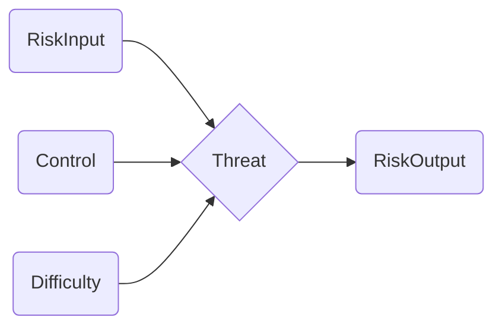
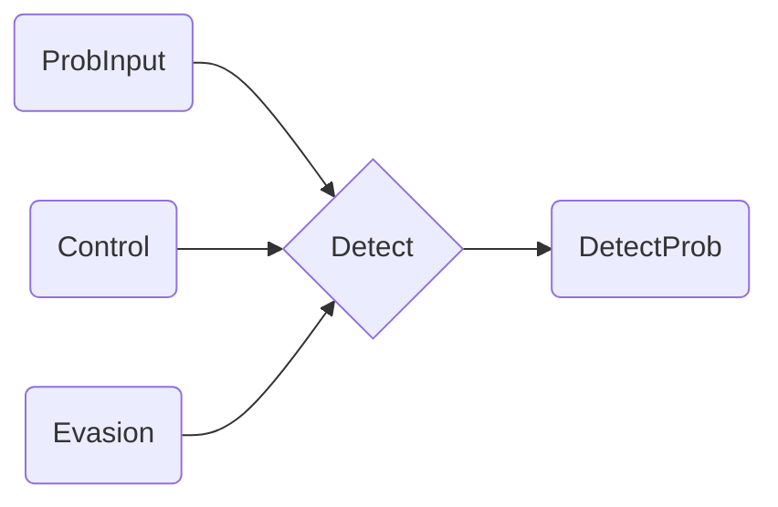
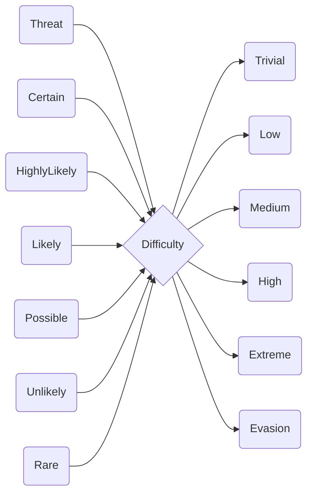
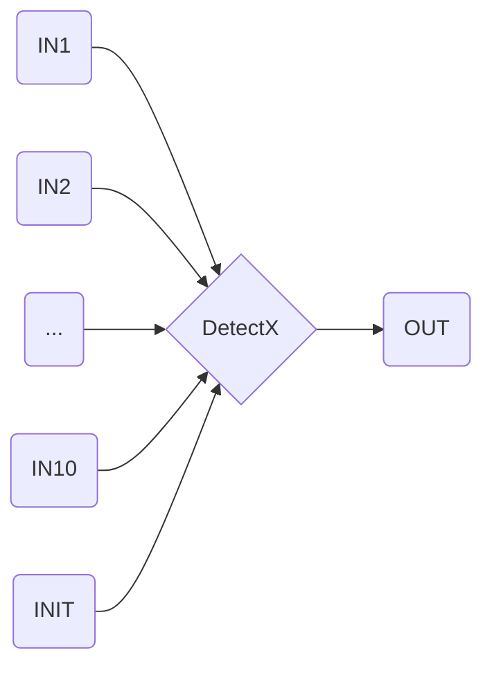
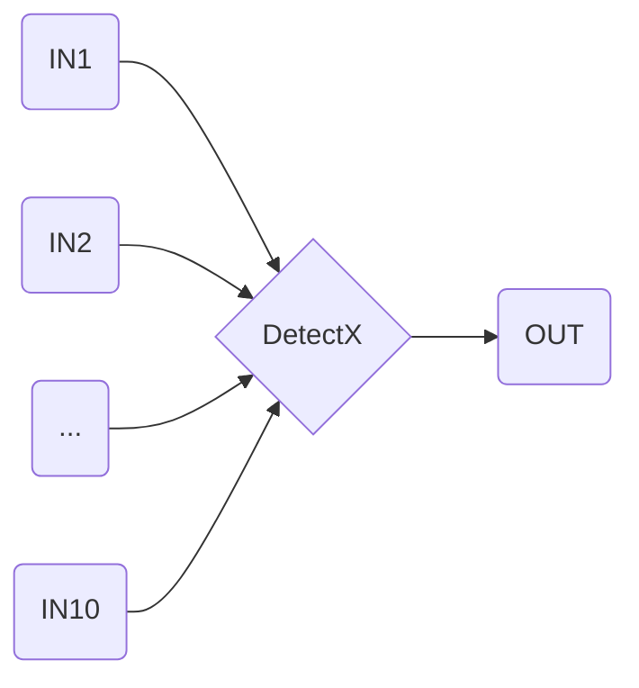

# ConstraintBlocks

## Threat

The `Threat` constraint block is used to calculate the residual probability of the threat succeeding at a particular `ThreatAction` node. These constraint blocks are chained together in series for a particular branch of the attack tree, which calculates the overall residual probability of the attack succeeding.

The `Threat` constraint block has three inputs:
 - RiskInput - which brings in the probability of this particular `ThreatAction` will be attempted, and is connected to the RiskOutput of the previous `ThreatAction` or the [`InitialProbability`](./stereotypes.md#initialprobability) value property if this is the first `ThreatAction` in the threat path;
 - Control - which brings in the [`MitigatingControlEffectiveness`](./stereotypes.md#mitigationcontroleffectiveness) value property associated with this `ThreatAction`; and
 - Difficulty - which brings in the value from the [`Difficulty`](#difficulty) constraint block output that matches the `Difficulty` of the `ThreatAction`.

Each of these inputs is expressed as a percentage, with the RiskInput representing the percent likelihood that the threat path will reach this `Threat` constraint block, the Control representing the percent likelihood that this `ThreatAction` will be prevented by the mitigating controls that are in place and the Difficulty representing the percentage likelihood that the identified threat actor will be able to perform this `ThreatAction` irrespective or any mitigating controls that are in place.

The `Threat` constraint block has a single ouput, which is calculated with the following formula:

$RiskOutput = {RiskInput \over 100} * {(100 - Control) \over 100} * {Difficulty \over 100} * 100$

This RiskOutput is connected to the input of the next `Threat` constraint block. The RiskOutput from the last `ThreatAction` in the threat path will connected to the [`ResidualProbability`](./stereotypes.md#residualprobability) value property.

> **Note**: The formula used in this constraint block treats all control effectiveness values across the entire threat path as independent variables. In reality, these may not be independent variables in all situations - eg. the same control is present at multiple steps of the threat path and if it is ineffective once, it would be completely ineffective the second time. This is a known limitation of the CEMT and needs to be addressed by the modeller by setting the control effectiveness values in a way which accounts for these dependent variables.

## Detect

The `Detect` constraint block is used to calculate the probability of the threat being detected at a particular `DetectionAction` node. These constraint blocks are combined together in parallel by the [`DetectX`](#detectx) constraint block to caluclate the overall probability of the attack being detected.

The `Detect` constraint block has three inputs:
 - ProbInput - which brings in the probability of this particular `DetectionAction` will be triggered, and is connected to the RiskInput of the  `ThreatAction` associated with this `DetectionAction`;
 - Control - which brings in the [`DetectionControlEffectiveness`](./stereotypes.md#detectioncontroleffectiveness) value property associated with this `DetectionAction`; and
 - Evasion - which brings in the Evasion value from the [`Difficulty`](#difficulty) constraint block.

Each of these inputs is expressed as a percentage, with the ProbInput representing the percent likelihood that the detection path will reach this `Detect` constraint block, the Control representing the percent likelihood that this `DetectionAction` will be successfully completed by the detection controls that are in place and the Evasion representing the percentage likelihood that the identified threat actor will be able to bypass the detecting controls associated with this `DetectionAction`.

The `Detect` constraint block has a single ouput, which is calculated with the following formula:

$DetectProb = {ProbInput \over 100} * {(100 - Control) \over 100} * {Evasion \over 100} * 100$

This DetectProb is connected to the INX inputs of the [`DetectX`](#detectx) constraint block. 

> **Note**: The formula used in this constraint block treats all control effectiveness values across the entire threat path as independent variables. In reality, these may not be independent variables in all situations - eg. the same control is present at multiple steps of the threat path and if it is ineffective once, it would be completely ineffective the second time. This is a known limitation of the CEMT and needs to be addressed by the modeller by setting the control effectiveness values in a way which accounts for these dependent variables.

## Difficulty

The `Difficulty` constraint block is used to convert the qualitative threat level into a quantitative likelihood that the attacker will be able to perform a `ThreatAction` of a particular difficulty, as well as a quantitive likelihood that the attacker will be able to evade detection.

The `Detect` constraint block has seven inputs:
 - Threat - which is the [`ThreatLevel`](./stereotypes.md#threatlevel) selected for a particular simulation;
 - Certain - which provides a quantitative likelihood range for activities deemed Certain. It is set by default to a `min` value of 100 and `max` value of 100 by the [Risk macro](../Macros/README.md#risk), though this can be modified by the modeller on a case-by-case basis; 
 - HighlyLikely - which provides a quantitative likelihood range for activities deemed HighlyLikely. It is set by default to a `min` value of 80 and `max` value of 90 by the [Risk macro](../Macros/README.md#risk), though this can be modified by the modeller on a case-by-case basis; 
 - Likely - which provides a quantitative likelihood range for activities deemed Likely. It is set by default to a `min` value of 60 and `max` value of 70 by the [Risk macro](../Macros/README.md#risk), though this can be modified by the modeller on a case-by-case basis; 
 - Possible - which provides a quantitative likelihood range for activities deemed Possible. It is set by default to a `min` value of 40 and `max` value of 50 by the [Risk macro](../Macros/README.md#risk), though this can be modified by the modeller on a case-by-case basis; 
 - Unlikely - which provides a quantitative likelihood range for activities deemed Unlikely. It is set by default to a `min` value of 20 and `max` value of 30 by the [Risk macro](../Macros/README.md#risk), though this can be modified by the modeller on a case-by-case basis; and
 - Rare - which provides a quantitative likelihood range for activities deemed Rare. It is set by default to a `min` value of 0 and `max` value of 10 by the [Risk macro](../Macros/README.md#risk), though this can be modified by the modeller on a case-by-case basis.

The `Detect` constraint block acts as a lookup table, with the outputs being made equal to the value of the inputs based on the selected `ThreatLevel`:

| Threat           | Trivial | Low          | Medium       | High         | Extreme | Evasion      |
|:----------------:|:-------:|:------------:|:------------:|:------------:|:-------:|:------------:|
| **Novice**       | Certain | Unlikely     | Rare         | Rare         | Rare    | Rare         |
| **Intermediate** | Certain | HighlyLikely | Possible     | Rare         | Rare    | Unlikely     |
| **Activist**     | Certain | Certain      | HighlyLikely | Possible     | Rare    | Likely       |
| **Nation State** | Certain | Certain      | Certain      | HighlyLikely | Likely  | HighlyLikely |

The Evasion output is connected to each [`Detect`](#detect) constraint block, while the other outputs are connected to the [`Threat`](#threat) constraint blocks which have a difficulty matching the output name. 

## DetectX

The `DetectX` constraint block is used to combine the individual detection probability output from each [`Detect`](#detect) constraint block into an overall detection probability. The `DetectX` constraint block is actually a series of constraint blocks:
 - Detect1;
 - Detect2;
 - Detect3;
 - Detect4;
 - Detect5;
 - Detect6;
 - Detect7;
 - Detect8;
 - Detect9; and
 - Detect10.
 
The number in the name of the constraint block aligns with the number of `Detect` constraint blocks that are in the SysML Parametric Diagram, which determines how many inputs the constraint block needs to contain in order to combine them all.

The `DetectX` constraint block has multiple inputs:
 - IN1 through IN10 - which contain the individual detection probabilities from the [`Detect`](#detect) constraint blocks; and
 - INIT - which contains the [`InitialProbability`](./stereotypes.md#initialprobability) value property.

The `DetectX` constraint block has a single ouput, which is calculated with the following formula:

$OUT = {(1 - (1 - {IN1 \over 100})(1 - {IN2 \over 100})...(1 - {IN10 \over 100})) \over {INIT \over 100} } * 100  $

The IN1 through IN10 values are summed together to give the overall likelihood of any one of those detections occuring. This is then divided by the `InitialProbability` value so that the OUT value is expressed as the likelihood of a detection *if* the attack is attempted. This value is then multiplied by 100 so that it is output as a percentage.

## CombineX

The `CombineX` constraint block is used to combine multiple [`DetectX`](#detectx) constraint blocks into an overall detection probability when there are more than 10 detection nodes in the parametric diagram. The `CombineX` constraint block is actually a series of constraint blocks:
 - Combine1;
 - Combine2;
 - Combine3;
 - Combine4;
 - Combine5;
 - Combine6;
 - Combine7;
 - Combine8;
 - Combine9; and
 - Combine10.
 
The number in the name of the constraint block aligns with the number of `DetectX` constraint blocks that are in the SysML Parametric Diagram, which determines how many inputs the constraint block needs to contain in order to combine them all.

The `CombineX` constraint block has multiple inputs:
 - IN1 through IN10 - which contain the individual detection probabilities from the [`DetectX`](#detectx) constraint blocks.

The `CombineX` constraint block has a single ouput, which is calculated with the following formula:

$OUT = (1 - (1 - {IN1 \over 100})(1 - {IN2 \over 100})...(1 - {IN10 \over 100}))  $

The IN1 through IN10 values are summed together to give the overall likelihood of any one of those detections occuring. There is moderation of this calculation by the `InitialProbability` value, like there was for the [`DetectX`](#detectx) constraint blocks, as all values have already been modified in this way by the `DetectX` constraint blocks.

> **Note**: The `DetectX` block only works for up to 10 detection probability inputs, and the `CombineX` block only works for up to 10 `DetectX` blocks. This means that if an attack tree branch is longer than 100 nodes, the [Risk.js macro](../Macros/README.md#risk) will not be able to build the SysML Parametric Diagram because the CEMT profile does not have a `Combine11` or higher constraint block. While it is expected that 100 nodes is sufficient for most situations, if your attack tree has branches longer than 100 nodes, more `CombineX` constraint blocks will need to be added to the profile, and the Risk.js macro will need to be updated to modify the length check on the threat path.