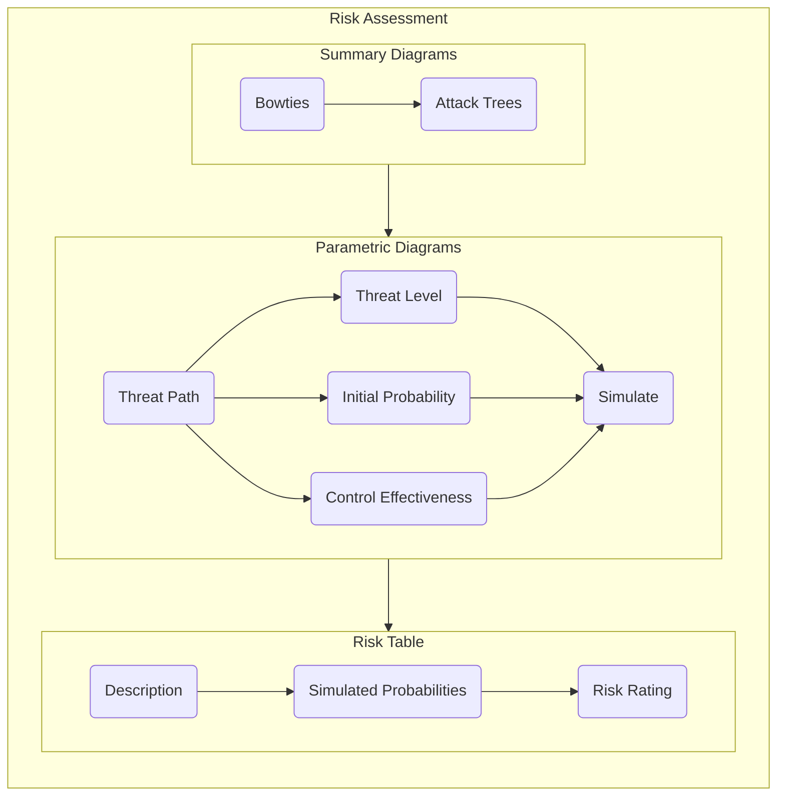
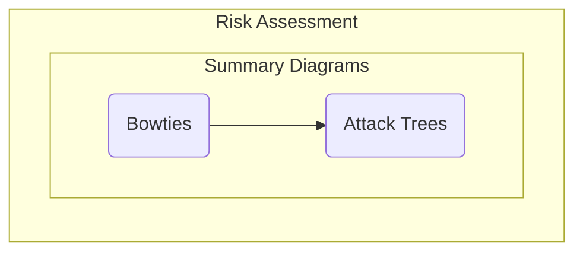
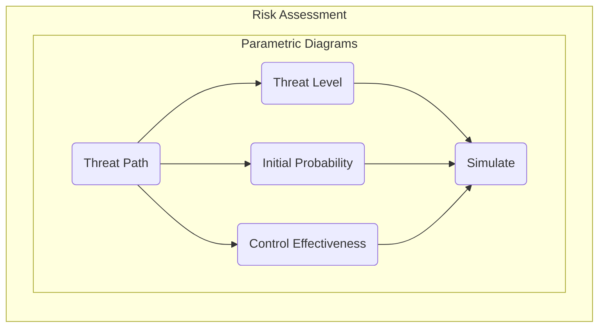
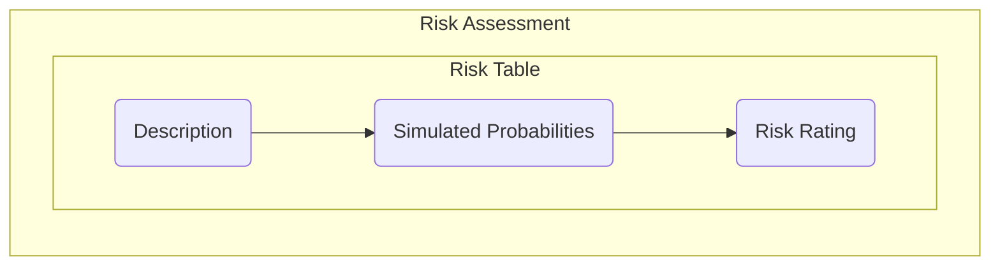

# Risk Assessment

The risk assessment stage involves the use of Relationship Maps and Parametric Diagrams to assess the likelihood of a particular threat succeeding. The purpose of this activity is to provide determine a risk rating for key threat paths identified in the earlier stages. Click on the steps in the flowchart below to see additional detail and instructions.

## Overview

The risk assessment process requires the interrogation of the views developed during the threat modelling and threat mitigation stages in order to develop a qualitative risk rating for each threat path. While this is necessarily a collaborative process between modellers, reviewers and decision makers, it is more effective for the modeller to complete the process in isolation and then iterate on that first draft with the input of reviewers and decision makers.

> **Note**: The information contained in this documentation set aims to guide a modeller and provide instructions on how to use the CEMT to produce the necessary views in CAMEO Systems Modeler. The production of an accurate and comprehensive model with appropriate mitigations depends on the cybersecurity expertise and the system knowledge of the modelling team; this documentation simply outlines how to use the CEMT, not how to produce a comprehensive risk assessment.

## Summary Diagrams

Summary Diagrams are automatically generated diagrams that are built based on the relationships between objects which were created during the threat modelling and threat mitigation stages. They provide useful summaries of the detail of the threat model to assist decision makers in determining whether sufficient mitigations are in place.

The summary diagrams are created using the `Relationship Map` diagram that is built into CAMEO Systems Modeler. These are pre-defined as part of the CEMT, and are copied across from the `Cyber Profile` as shown below:

https://user-images.githubusercontent.com/7237737/177059450-a97e0c5d-5020-4f10-9a62-4c394498e6b6.mp4

The summary diagrams are contained in the `Summary Diagrams` package, and include:

 - Attack Trees - Impact: An attack tree that begins at an undesirable outcome and shows all paths leading to that outcome;
 - Attack Trees - Misuse Case: An attack tree that begins at the misuse case starting node and shows all paths leading from that node;
 - Bowtie - Action: A bowtie diagram that shows the mitigation controls and detecting controls associated with specific actions;
 - Bowtie - Asset: A bowtie diagram that shows the mitigation controls and detecting controls associated with specific assets; and
 - Bowtie - Misuse Case: A bowtie diagram that shows the mitigation controls and detecting controls associated with specific misuse cases.

Summary diagrams use `Smart Packages` as a method for easily filtering the contents of the various summary diagrams. This provides a drag-and-drop method for modellers to filter the diagrams, without having to understand the minutae of the stereotypes and relationships being queried by the diagrams. These smart package filters are also contained in the `Summary Diagrams` package.

The table below shows which filters must be set for each type of Summary Diagram.

|                               | Action Filter | Asset Filter | Impact Filter | Misuse Case Filter |
|:-----------------------------:|:-------------:|:------------:|:-------------:|:------------------:|
| **Bowtie - Action**           |       X       |      X       |               |                    |
| **Bowtie - Asset**            |               |      X       |               |                    |
| **Bowtie - Misuse Case**      |               |      X       |               |         X          |
| **Attack Tree - Impact**      |               |      X       |       X       |                    |
| **Attack Tree - Misuse Case** |               |      X       |               |         X          |

Filters are set by dragging an object from the 'Unassigned' smart packages into the Filter smart packages. They can be removed from the filter by selecting the object in the Filter smart package and pressing delete.

**Insert Video**

### Bowties

The first set of summary diagrams are Bowtie diagrams, which are a concept derived from the Bowtie Diagras that are commonly used in System Safety analysis. These diagrams provide a high level view of the mitigating controls and detecting controls associated with an asset, action or misuse case as well as the implementation status of those controls.

As these drawings are automatically generated by the toolset, there is no need for the modeller to draw any diagrams. Instead, they need to modify the filters to ensure only the relevant information is displayed on these diagrams.

There are three different Bowtie Diagrams included in the CEMT:
 - `Bowtie - Misuse Case`
 - `Bowtie - Asset`
 - `Bowtie - Action`

Bowtie - Misuse Case: Summary + Picture

Bowtie - Asset: Summary + Picture

Bowtie - Action: Summary + Picture

### Attack Trees

## Parametric Diagrams

### Threat Path

### Threat Level

### Initial Probability

### Control Effectiveness

### Simulate

## Risk Table

### Description

### Simulated Probabilities

### Risk Rating

 > [Return to Modelling Process Flowchart](/README.md#risk-assessment)