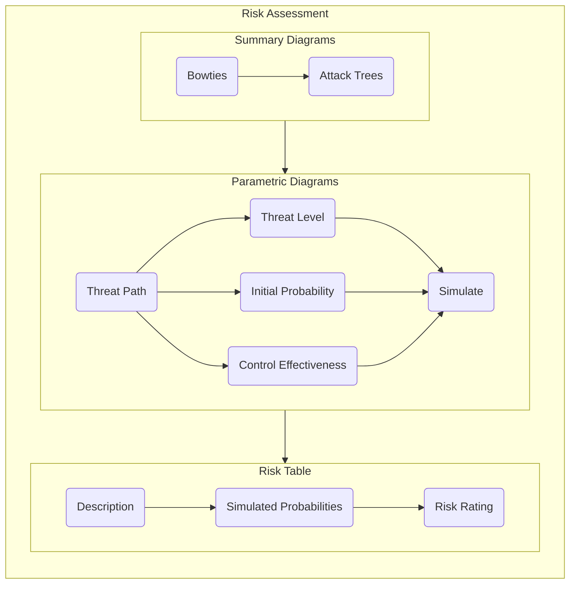
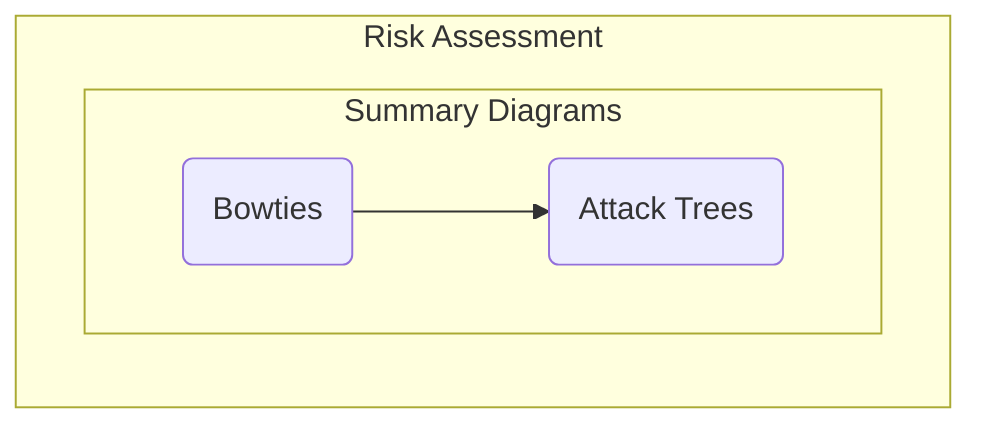
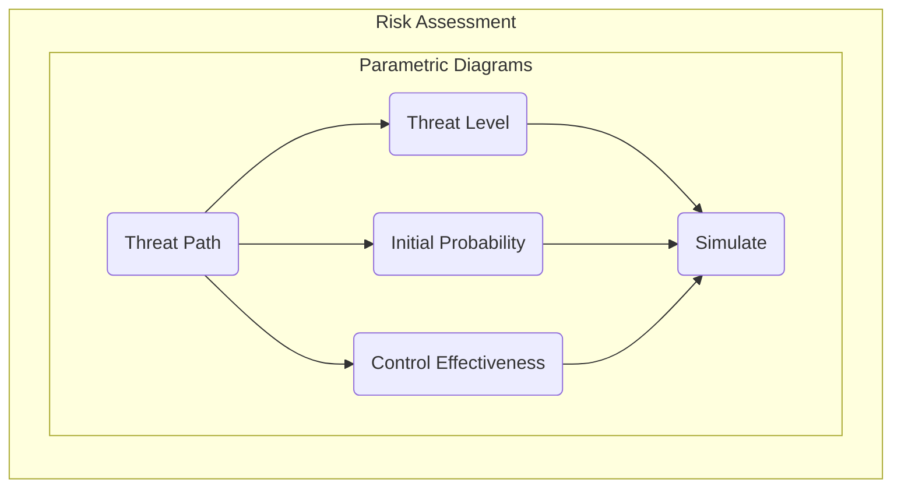
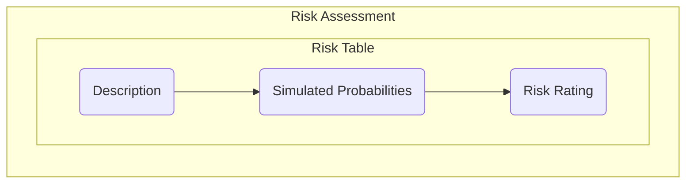

# Risk Assessment

The threat mitigation stage involves the use of Relationship Maps and Parametric Diagrams to assess the likelihood of a particular threat succeeding. The purpose of this activity is to provide determine a risk rating for key threat paths identified in the earlier stages. Click on the steps in the flowchart below to see additional detail and instructions.

## Overview

## Summary Diagrams

### Bowties

### Attack Trees

## Parametric Diagrams

### Threat Path

### Threat Level

### Initial Probability

### Control Effectiveness

### Simulate

## Risk Table

### Description

### Simulated Probabilities

### Risk Rating

 > [Return to Modelling Process Flowchart](/README.md#risk-assessment)