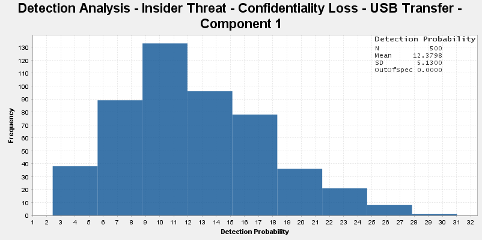

# Risk Assessment

The risk assessment stage involves the use of Relationship Maps and Parametric Diagrams to assess the likelihood of a particular threat succeeding. The purpose of this activity is to provide determine a risk rating for key threat paths identified in the earlier stages. Click on the steps in the flowchart below to see additional detail and instructions.

## Overview

The risk assessment process requires the interrogation of the views developed during the threat modelling and threat mitigation stages in order to develop a qualitative risk rating for each threat path. While this is necessarily a collaborative process between modellers, reviewers and decision makers, it is more effective for the modeller to complete the process in isolation and then iterate on that first draft with the input of reviewers and decision makers.

> **Note**: The information contained in this documentation set aims to guide a modeller and provide instructions on how to use the CEMT to produce the necessary views in CAMEO Systems Modeler. The production of an accurate and comprehensive model with appropriate mitigations depends on the cybersecurity expertise and the system knowledge of the modelling team; this documentation simply outlines how to use the CEMT, not how to produce a comprehensive risk assessment.

## Summary Diagrams

Summary Diagrams are automatically generated diagrams that are built based on the relationships between objects which were created during the threat modelling and threat mitigation stages. They provide useful summaries of the detail of the threat model to assist decision makers in determining whether sufficient mitigations are in place.

The summary diagrams are created using the `Relationship Map` diagram that is built into CAMEO Systems Modeler. These are pre-defined as part of the CEMT, and are copied across from the `Cyber Profile` as shown below:

https://user-images.githubusercontent.com/7237737/177059450-a97e0c5d-5020-4f10-9a62-4c394498e6b6.mp4

The summary diagrams are contained in the `Summary Diagrams` package, and include:

 - Attack Trees - Impact: An attack tree that begins at an undesirable outcome and shows all paths leading to that outcome;
 - Attack Trees - Misuse Case: An attack tree that begins at the misuse case starting node and shows all paths leading from that node;
 - Bowtie - Action: A bowtie diagram that shows the mitigation controls and detecting controls associated with specific actions;
 - Bowtie - Asset: A bowtie diagram that shows the mitigation controls and detecting controls associated with specific assets; and
 - Bowtie - Misuse Case: A bowtie diagram that shows the mitigation controls and detecting controls associated with specific misuse cases.

Summary diagrams use `Smart Packages` as a method for easily filtering the contents of the various summary diagrams. This provides a drag-and-drop method for modellers to filter the diagrams, without having to understand the minutae of the stereotypes and relationships being queried by the diagrams. These smart package filters are also contained in the `Summary Diagrams` package.

The table below shows which filters must be set for each type of Summary Diagram.

|                               | Action Filter | Asset Filter | Impact Filter | Misuse Case Filter |
|:-----------------------------:|:-------------:|:------------:|:-------------:|:------------------:|
| **Bowtie - Action**           |       X       |      X       |               |                    |
| **Bowtie - Asset**            |               |      X       |               |                    |
| **Bowtie - Misuse Case**      |               |      X       |               |         X          |
| **Attack Tree - Impact**      |               |      X       |       X       |                    |
| **Attack Tree - Misuse Case** |               |      X       |               |         X          |

Filters are set by dragging an object from the 'Unassigned' smart packages into the Filter smart packages. Objects can also be added to the filter by selecting them in the containment tree and running the [Filter macro](../Macros/Filter.js). They can be removed from the filter by selecting the object in the Filter smart package and pressing delete.

https://user-images.githubusercontent.com/7237737/187450843-6cc65c0d-5f8f-4d00-a8a0-153fb5e6378a.mp4

### Mitigation Trees

The first set of summary diagrams are Mitigation Tree diagrams, which provide a summary status of the mitigations in the assessment. These diagrams provide a high level view of the mitigating controls and detecting controls associated with a misuse case as well as the implementation status of those controls.

As these drawings are automatically generated by the toolset, there is no need for the modeller to draw any diagrams. Instead, they need to modify the filters to ensure only the relevant information is displayed on these diagrams.

There are on type of Mitigation Tree Diagram included in the CEMT:
 - `Mitigation Tree - Misuse Case`

> **Note**: The mitigation tree diagrams depict the implementation status of the `SecurityProperty`s in the system. The implementation status (Proposed, Designed or Verified) that is displayed in the bowtie diagrams is dependent on the `Assessment Phase` selected on the [`System`](./stereotypes.md#system) object.

#### Mitigation Tree - Misuse Case

The Misuse Case Mitigation Tree Diagram depicts all of the threat and detection nodes within the selected Misuse Case, along with the `SecurityProperty`s associated with those threat and detection nodes, colour-coded by their implementation status. This diagrams provides a high level overview of the implementation status of all relevant controls that could feasibly be implemented. As noted in the [Security Control](./threat-mitigation.md#security-controls)s section, it is important to remember that it is not necessary a bad outcome if the controls are not implemented; the purpose of this bowtie diagram is not to assess some level of compliance status, but rather to provide a high level summary that can be used to inform a risk decision. An example Misuse Case Bowtie Diagram is shown below:

### Attack Trees

The second set of summary diagrams are Attack Tree diagrams, which are a relatively common tool for the analysis of cybersecurity threats. These diagrams provide a summary of the threat paths in the form a directed acyclic graph that shows the each threat path branching out from a start point. These can be used to explain the various paths which an attacker can take to compromise a system

As these drawings are automatically generated by the toolset, there is no need for the modeller to draw any diagrams. Instead, they need to modify the filters to ensure only the relevant information is displayed on these diagrams.

There are two different Attack Tree Diagrams included in the CEMT:
 - `Attack Tree - Misuse Case`
 - `Attack Tree - Impact`

> **Note**: If the attack tree is not being drawn correctly, the [NextThreatAction](./expressions.md#nextthreataction) and [PreviousThreatAction](./expressions.md#previousthreataction) expressions would be the first place to troubleshoot. Namely, the expressions are limited in how many layers of `AggregatedAction`s they will traverse, so there may be an edge case in your particular model that is not handled yet.

#### Attack Tree - Misuse Case

The Misuse Case Attack Tree Diagram shows the paths that an attacker would need to take to compromise the system from the initial startig point of one or more `Misuse Case`s. This provides an intuitive and informative summary of the threat surface of a system and provides insight into the relative criticality of securing particular nodes in the kill chain. As an example, shorter branches or nodes that are common across multiple branches are likely to be areas of increased docus in the risk assessment and overall cyberworthiness evaluation. The attack tree allows you to identify these critical nodes, and in conjunction with the [Action Bowtie Diagram](#bowtie---action), the modellers, reviewers and decision makers to focus in on those threat nodes and ask whether the current level of controls on those nodes are appropriate and acceptable. An example Misuse Case Attack Tree is shown below.

#### Attack Tree - Impact
The Impact Attack Tree is broadly similar to the Misuse Case Attack Tree, except that it starts at the undesirable outcome and works backwards, identifying all of the branches of threat paths leading to that undesirable outcome. An example Impact Attack Tree is shown below:

### Bowties

The first set of summary diagrams are Bowtie diagrams, which are a concept derived from the Bowtie Diagrams that are commonly used in System Safety analysis. These diagrams provide a high level view of the mitigating controls and detecting controls associated with an asset, action or misuse case as well as the implementation status of those controls.

As these drawings are automatically generated by the toolset, there is no need for the modeller to draw any diagrams. Instead, they need to modify the filters to ensure only the relevant information is displayed on these diagrams.

There are three different Bowtie Diagrams included in the CEMT:
 - `Bowtie - Misuse Case`
 - `Bowtie - Action`
 - `Bowtie - Asset`

> **Note**: The bowtie diagrams depict the implementation status of the `SecurityProperty`s in the system. The implementation status (Proposed, Designed or Verified) that is displayed in the bowtie diagrams is dependent on the `Assessment Phase` selected on the [`System`](./stereotypes.md#system) object.

#### Bowtie - Misuse Case

The Misuse Case Bowtie Diagram depicts all of the threat and detection nodes within the selected Misuse Case, along with the `SecurityProperty`s associated with those threat and detection nodes, colour-coded by their implementation status. This diagrams provides a high level overview of the implementation status of all relevant controls that could feasibly be implemented. As noted in the [Security Control](./threat-mitigation.md#security-controls)s section, it is important to remember that it is not necessary a bad outcome if the controls are not implemented; the purpose of this bowtie diagram is not to assess some level of compliance status, but rather to provide a high level summary that can be used to inform a risk decision. An example Misuse Case Bowtie Diagram is shown below:

#### Bowtie - Action

The Action Bowtie Diagram provides a more focused summary of a single threat node from the attack tree. This diagram will show the `ThreatAction`s set in the `Action Filter` smart package, as well as the associated mitigating or preventative threats on the left, the linked detection action and then the associated detecting controls on the right. Each of the controls will be colour coded according to their implementation state. These focused diagrams are useful when reviewing the [`Attack Trees`](#attack-trees) and you want to display detailed information of a particular node of the attack tree. An example Action Bowtie Diagram is shown below:

#### Bowtie - Asset

The Asset Bowtie Diagram shows the controls associated with a particular asset. This diagram will show the `Asset`s set in the `Asset Filter` smart package, as well as the associated security controls, split into mitigating or preventative controls on the left and detecting controls on the right. Each of the controls will be colour coded according to their implementation state on that particular asset. These diagrams can be useful when considering changes to assets, such as obsolescence studies, or to investigate the level of control implementation in particularly critical assets. An example Asset Bowtie Diagram is shown below:

## Parametric Risk Diagrams

Parametric Risk Diagrams are used to provide a quantitative assessment of the likelihood of a particular risk or threat path being achieved, as well as the likelihood of the system detecting the attempt. This step involves the creation of these diagrams as well as agreeing upon the critical variables and assumptions that drive that quantitative assessment.

The Parametric Risk Diagrams are created using the `CEMT Parametric Risk Diagram`. However, these diagrams do not need to be manually created by the modeller as the modeller can leverage the [Risk Macro](../Macros/Risk.js) to generate the majority of the diagram from the existing relationships within the model.

Parametric Risk Diagrams use the following CEMT stereotypes:

 - [`SecurityRisk`](./stereotypes.md#securityrisk)
 - [`ValueProperty`](./stereotypes.md#valueproperty)
   - [`ThreatLevel`](./stereotypes.md#threatlevel)
   - [`InitialProbability`](./stereotypes.md#initialprobability)
   - [`ResidualProbability`](./stereotypes.md#residualprobability)
   - [`DetectionProbability`](./stereotypes.md#detectionprobability)
   - [`DetectionControlEffectiveness`](./stereotypes.md#detectioncontroleffectiveness)
   - [`MitigationControlEffectiveness`](./stereotypes.md#mitigationcontroleffectiveness)
   - [`difficultyProperty`](./stereotypes.md#difficultyproperty)
 - [`ConstraintProperty`](./stereotypes.md#constraintproperty)
   - [`ThreatConstraint`](./stereotypes.md#threatconstraint)
   - [`DetectConstraint`](./stereotypes.md#detectconstraint)
   - [`DifficultyConstraint`](./stereotypes.md#difficultyconstraint)
 - [`SecurityProperty`](./stereotypes.md#securityproperty)
 - [`Asset`](./stereotypes.md#asset)

> **Note**: This section outlines the process for created a Parametric Risk Diagram for a single threat path in the model. The expectation is that the modeller creates one of these Parametric Risk Diagrams for each of the threat paths that they critical enough to warrant the detailed risk assessment. While you could perform this step for every single branch of the attack tree, it is more likely that a subset of the paths are assessed at this level of detail, based on the review of the Bowtie Diagrams and Attack Tree Diagrams.

### Threat Path

The first step is to run the [Risk Macro](../Macros/Risk.js) to generate the base Parametric Risk Diagram. This involves navigating to the Attack Tree Diagram, selecting a single branch of that attack tree, selecting those objects in the containment tree (using the `Alt+B` shortcut) and then running the Risk macro. This will generate a Parametric Risk Diagram for that particular branch of the Attack Tree along with all the objects to simulate that parametric diagram.

The macro has two arguments, which you will be asked for when running the macro:
 - `threatName`; and
 - `assetSelectionPath`.

`threatName` is the name that you want to give to the particular threat path you have selected. This will be used to name the risk. `assetSelectionPath` is an optional argument, where you can provide the `Qualified Name` of a particular `Asset` and the macro will only include that asset in the parametric diagram. If you leave the `assetSelectionPath` argument blank, all relevant `Asset`s will be included in the parametric risk diagram that hte macro generates.

https://user-images.githubusercontent.com/7237737/192251371-b3966b14-65e5-4e71-8216-9a8af071e8bc.mp4

An example of the generated parametric risk diagram is shown below:

### Threat Level

The next step once the Parametric Risk Diagram has been created is to set the [ThreatLevel](./stereotypes.md#threatlevel) of the threat that you are trying to simulate. The modeller is able to choose between 4 options:
 - Nation State;
 - Activist;
 - Intermediate; and
 - Novice.

This setting determines how likely the threat actor is to be able to complete the threat node of a particular difficulty and to evade the detection capabilities of the system. The lookup table used to convert these `ThreatLevel`s into likelihoods to complete threat nodes of a particular difficulty in shown below.

| Difficulty Level | Novice   | Intermediate | Activist     | Nation State |
|:----------------:|:--------:|:------------:|:------------:|:------------:|
| **Trivial**      | Certain  | Certain      | Certain      | Certain      |
| **Low**          | Unlikely | HighlyLikely | Certain      | Certain      |
| **Medium**       | Rare     | Possible     | HighlyLikely | Certain      |
| **High**         | Rare     | Rare         | Possible     | HighlyLikely |
| **Extreme**      | Rare     | Rare         | Rare         | Likely       |
| **Evasion**      | Rare     | Unlikely     | Likely       | HighlyLikely |

While the lookup table above is hardcoded into the CEMT profile, the quantitative definition of each of those qualitative likelihoods can be modified by the modeller in the parametric risk diagram. By modifying the `min` and `max` vlaues of the `Certain`, `HighlyLikely`, `Likely`, `Possible`, `Unlikely` and `Rare` property values in the diagram the modeller can set the values that are used for each of these likelihood descriptors in the simulation. These values are set to a reasonable default by the [Risk Macro](../Macros/Risk.js) the generates the parametric risk diagram, but the flexibility for the modeller to modify these is available, if required.

https://user-images.githubusercontent.com/7237737/192251448-5d66eae1-4956-49da-ac96-1ff59f439332.mp4

> **Note**: The `min` and `max` values represent the minimum and maximum values of a uniform distribution to account for the uncertainty in the estimation of these likelihoods. The simulation will select a value within that uniform distribution for each simulation run when calculating the result. A sensitivity analysis of each value can be conducted by fixing every other variable and allowing just one to vary across the uniform distribution.

### Initial Probability

The next step is to set the [`InitialProbability`](./stereotypes.md#initialprobability) in the parametric risk diagram. This is done by setting the `Default Value` attribute of the `InitialProbability` property. When the [Risk Macro](../Macros/Risk.js) first creates the parametric risk diagram, this initial probability will be set to 100, representing an engineering assessment of the risk - ie. if the attack is attempted, what is the residual likelihood that it will succeed. 

If you wanted to perform an operational assessment of risk, the likelihood that this particular attack will be attempted should be modelled by adjusting the initial probability to match the expected likelihood of the attack being attempted by an adversary on that particular operation.

https://user-images.githubusercontent.com/7237737/192251489-2e0640f9-5081-4208-ae98-1c431fdc0976.mp4

### Control Effectiveness

The next step involves selecting the [`MitigationControlEffectiveness`](./stereotypes.md#mitigationcontroleffectiveness) and [`DetectionControlEffectiveness`](./stereotypes.md#detectioncontroleffectiveness) values within the parametric risk diagram. There is one of these values for each node in the threat path, and this value represents the percentage of attempts to perform the specific action described by the node that would be stopped by the controls that are in place. A strong control set which provided good protection would have a high control effectiveness, while a poor control set would have a low control effectiveness. Determining this value requires a collaborative assessment of the implementation state of potential controls and an assessment of the effectiveness of those controls in stopping the threat from progressing.

Determining this value is not an exact science, and inevitably this will be a case of expert judgement to determine the value. While this is undesirable, the primary focus here is to eliminate opqaue expert judgement by requiring these estimations and judgements to be made at a specific level of detail which can be reviewed, interrogated and ultimately agreed. The ability to set a `min` and `max` value allows us to handle some of this uncertainty, and a sensitivity analysis can be performed on these effectiveness values by setting all other simulation variables to a constant and observing the impact on the output.

https://user-images.githubusercontent.com/7237737/192251582-bcdcbbc0-a873-4336-915e-2a429ac16198.mp4

> **Note**: It is important to be clear about the limitations of this methodology in calculating an accurate residual risk. The simulation treats each of the control effectiveness values (and indeed, the ability of a particular threat actor to complete a task of particular difficulty) as independent events. While the attacker does need to do all of the actions in sequence, in many circumstances these events may not be truly independent - ie. if a particular controls was ineffective early in the threat path and was linked again later in the threat path, the simulation would treat these as independent even though if the contorl was bypassed earlier, it should actually have an effectiveness of 0 the second time. This is a known limitation of the calculation, and the purpose of this note is to say that the quantitative figures from these simulations should be used as a guide, rather than an answer. It is for this reason that the calculated likelihood values are converted back into a qualitative rating in the [Risk Assessment Table](#risk-assessment-table), so as not to give the incorrect impression of an accurate answer. For a detailed understanding of how the values are calculated in the simulation, please refer to the constraint definitions, particularly the [`Threat`](./constraints.md#threat) and [`Detect`](./constraints.md#detect) stereotypes.

### Simulate

The final step on the parametric risk diagram is to run the simulation. This will cause the model to randomly choose a value for each input variable within the ranges that were set and calculate the resultant [`ResidualProbability`](./stereotypes.md#residualprobability) and [`DetectionProbability`](./stereotypes.md#detectionprobability). This will be repeated 500 times, with the results plotted onto two histograms, along with a mean and standard deviation for the full dataset.

https://user-images.githubusercontent.com/7237737/192251648-90032f4d-eb9e-4e59-b98c-f2f78d4a4db4.mp4

The histograms will be automatically saved to the file system where the model is located, but it is a good idea to take your own copy, as the file could be overwritten if the simulation is run again. An example of the resulting histograms is shown below:

### Additional Optional Steps

It is possible to combine two parametric risk diagrams together into an aggregated risk. This is useful when combining a [Threat Path](#threat-path) which could represent the loss of a redundant function, with another threat path that represents the loss of the same primary function. This can be achieved by selecting two [`SecurityRisk`s](./stereotypes.md#securityrisk) in the containment tree and running the [CombineRisks Macro](../Macros/CombineRisks.js). This would normally be used when two co-requisite threat paths have been modelled using `ThreatJoin`s and `PostureImpactSignal`s, as described in the [Threat Modelling](./threat-modelling.md#additional-optional-steps-1) section.

However, any two risks could be combined in this way, including a risk that is already made of two other risks that have been combined through the [CombineRisks Macro](../Macros/CombineRisks.js). This can be used to combine more than two risks together, if desired.

## Risk Assessment Tables

The Risk Assessment Tables are used to provide a summary of the risks that have been assessed through the CEMT process. They provide the mitigation details relevant to each risk and ultimately produces a qualitative residual risk assessment for each risk.

The Risk Assessment Tables are created using the `Generic Table` diagram that is built into CAMEO Systems Modeler. This is pre-defined as part of the CEMT template, but can be manually copied across from the `Cyber Profile` as shown below:

https://user-images.githubusercontent.com/7237737/177059450-a97e0c5d-5020-4f10-9a62-4c394498e6b6.mp4

### Risk Lists

The Risk Lists, are actually three separate tables:
 - Risk List - Proposed: which should be populated when the assessment is being done prior to the detail of a system being designed;
 - Risk List - Designed: which should be populated when the assessment is being done as part of detailed system design; and
 - Risk List - Verified: which should be populated when the assessment is being done following a verfication activity on the built system to determine `SecurityProperty` status.

 These tables are used to capture additional data about the risk which needs to be input by the modeller. The three tables are functionally identical and all of them contain a complete list all of the `SecurityRisk`s in the project, however, they each display a different subset of the `SecurityRisk` attributes associated with each of the `Assessment Phase`s.

 The fields that need to be set by the modeller are listed below.

#### Description

The first step is populating the risk list is to input a Risk Description. This is a free-form text field where the modeller should describe the risk so that reviewers and decision makers understand what this risk is in understandable terminology.

This field is common between the three Risk Lists, and only needs to be manually set in one of them.

https://user-images.githubusercontent.com/7237737/192251718-ab941b15-a845-4c29-9922-9168cddcfbbd.mp4

#### Simulated Probabilities

The next step is to input the critical variables and results from the simulation that was run. These fields do not automatically populate, because it would result in the last simulation run being populated into the risk table and the decision was made to have the fields manually set instead. To do this, the modeller should set the following fields in the risk list:
 - Simulation Initial Probability - which should reflect the `InitialProbability` used in the simulation;
 - Simulation Threat Level - which should reflect the `ThreatLevel` used in the simulation;
 - Simuation Residual Probability - which should reflect the mean `ResidualProbability` value on the Threat Histogram;
 - Simulation Detection Probability - which should reflect the mean `DetectionProbability` value on the Detection Histogram;
 - Threat Histogram - which contains the image of the threat histogram results from the simulation;
 - Detection Histogram - which contains the image of the detection histogram results form the simulation; and
 - Parametric - which contains an image of the parametric risk diagram, capturing the input variables for the simulation.

To attach the histogram and parametric diagram images, the saved images can be dragged into the containment tree from the file system, which will create an `AttachedFile` object which can then be linked via the Risk List.

Each Risk List has a different set of attributes to cover these Simulated Probabilities, allowing for later risk assessments to also be captured, without overwritting the historic results from earlier lifecycle phases.

https://user-images.githubusercontent.com/7237737/192251762-a4d0cc16-f2cf-461e-b297-892761df5295.mp4

#### Risk Rating

The final step in the process is to select a resultant qualitative consequence, likelihood and risk rating. The modeller should set the following fields in the table:
 - [Likelihood](./enumerations.md#likelihood) - a qualitative assessment of the likelihood, using the simulated probabilities as an input to that decision;
 - Likelihood Justification - a free-form text field where the reasoning behind the likelihood determination should be documented;
 - [Consequence](./enumerations.md#consequence) - a qualitative assessment of the consequence of the threat being realised, using input from operational and system experts; and
 - Consequence Justification - a free-form text field where the reasoning behind the consequemce determination should be documented.

Once the Likelihood and Consequence values are set, the Risk Rating will be automatically set accordingly. The Likelihood, Consequence and Risk Rating values are based on the risk table below:

<table>
  <thead>
    <tr>
      <th rowspan=2 colspan=2>6x6 Security Risk Matrix</th>
      <th colspan=6>Consequence</th>
    </tr>
    <tr>
      <th>Minimal</th>
      <th>Minor</th>
      <th>Moderate</th>
      <th>Major</th>
      <th>Severe</th>
      <th>Catastrophic</th>
    </tr>
  </thead>
  <tbody>
    <tr>
      <th rowspan=6>Likelihood</th>
      <th>Extreme</th>
      <td>Moderate</td>
      <td>Significant</td>
      <td>High</td>
      <td>Extreme</td>
      <td>Extreme</td>
      <td>Extreme</td>
    </tr>
    <tr>
      <th>High</th>
      <td>Low</td>
      <td>Significant</td>
      <td>High</td>
      <td>High</td>
      <td>Extreme</td>
      <td>Extreme</td>
    </tr>
    <tr>
      <th>Medium</th>
      <td>Low</td>
      <td>Moderate</td>
      <td>Significant</td>
      <td>Significant</td>
      <td>High</td>
      <td>Extreme</td>
    </tr>
    <tr>
      <th>Low</th>
      <td>Low</td>
      <td>Low</td>
      <td>Moderate</td>
      <td>Moderate</td>
      <td>Significant</td>
      <td>High</td>
    </tr>
    <tr>
      <th>Very Low</th>
      <td>Low</td>
      <td>Low</td>
      <td>Low</td>
      <td>Moderate</td>
      <td>Moderate</td>
      <td>Significant</td>
    </tr>
    <tr>
      <th>Negligible</th>
      <td>Low</td>
      <td>Low</td>
      <td>Low</td>
      <td>Low</td>
      <td>Low</td>
      <td>Moderate</td>
    </tr>
  </tbody>
</table>

Each Risk List has a different set of attributes to cover these Risk Ratings, allowing for later risk assessments to also be captured, without overwritting the historic results from earlier lifecycle phases.

https://user-images.githubusercontent.com/7237737/192251847-7dfe99ef-b119-4155-adde-7e6188972936.mp4

### Risk Summary

The Risk Summary table is contained in the `Summary Diagrams` package. 

All of the fields in this table are auto-populated by the model. These automatically populated fields are:
 - Name - is generated based on the name given to the [`SecurityRisk`](./stereotypes.md#securityrisk) created when the parametric risk diagram was created;
 - Participating Asset - lists all of the `Assets` that are linked to the threat path in this risk;
 - Threat Path - lists the steps that an attacker must take to realise this risk;
 - Assessment Phase - displays the `Assessment Phase` currently selected on the `System` object;
 - Mitigating Controls - lists all of the preventative controls that are fully or partially implemented;
 - Detecting Controls - lists all of the detecting controls that are fully or partially implemented; 
 - Potential Additional Controls - lists all of the controls linked to the threat path that are not implemented;
 - [Likelihood](./enumerations.md#likelihood) - a qualitative assessment of the likelihood, using the simulated probabilities as an input to that decision;
 - Likelihood Justification - a free-form text field where the reasoning behind the likelihood determination should be documented;
 - [Consequence](./enumerations.md#consequence) - a qualitative assessment of the consequence of the threat being realised, using input from operational and system experts; and
 - Consequence Justification - a free-form text field where the reasoning behind the consequemce determination should be documented.
 - Simulation Initial Probability - which should reflect the `InitialProbability` used in the simulation;
 - Simulation Threat Level - which should reflect the `ThreatLevel` used in the simulation;
 - Simuation Residual Probability - which should reflect the mean `ResidualProbability` value on the Threat Histogram;  
 - Simulation Detection Probability - which should reflect the mean `DetectionProbability` value on the Detection Histogram;
 - Threat Histogram - which contains the image of the threat histogram results from the simulation;
 - Detection Histogram - which contains the image of the detection histogram results form the simulation; and
 - Parametric - which contains an image of the parametric risk diagram, capturing the input variables for the simulation.

The Risk Summary table will display the information from the relevant Risk List and `SecurityProperty` attributes, based on the `Assessment Phase` selected on the [`System`](./stereotypes.md#system) object. An example of a populated Risk Summary table is shown below. 

https://user-images.githubusercontent.com/7237737/192251960-3b4a65c4-3e76-4e20-880c-73621f79ac90.mp4

 > [Return to Modelling Process Flowchart](../README.md#risk-assessment)
