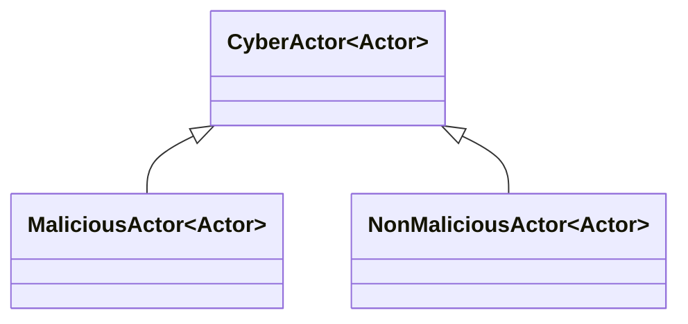
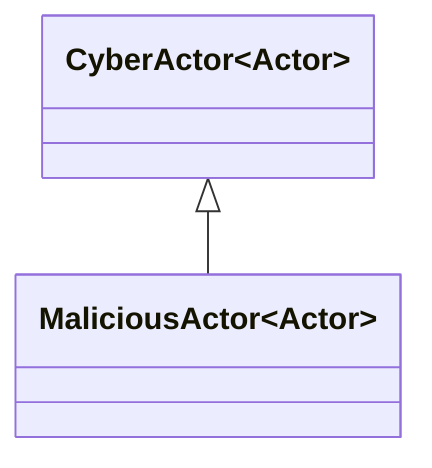
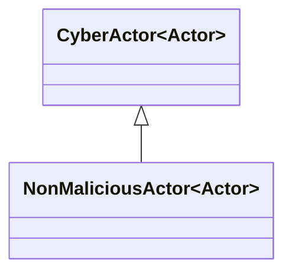
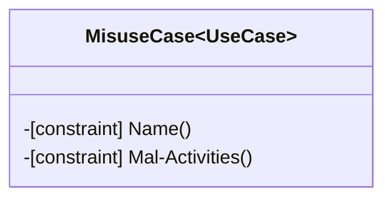
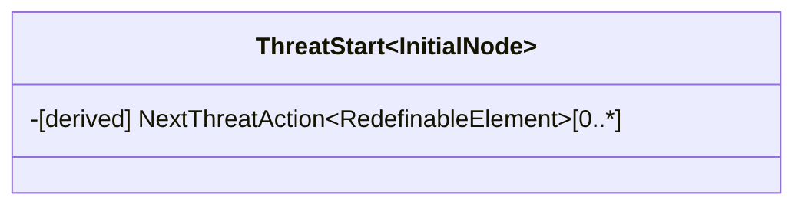
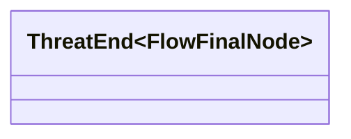
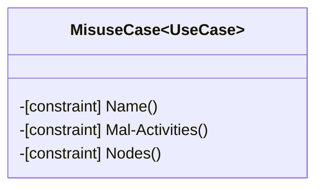
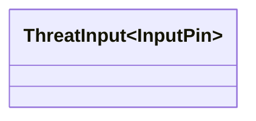
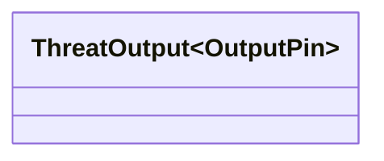
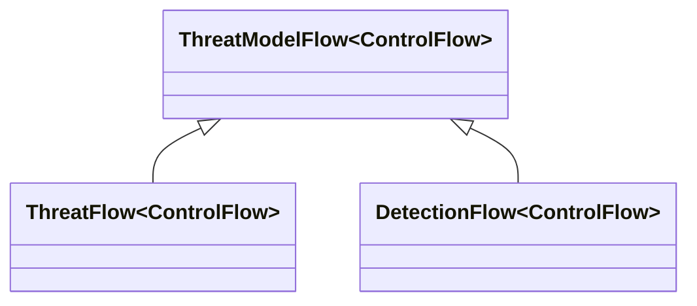

# Stereotypes

## CEMT Misuse Case Diagrams

### CyberActor

The `CyberActor` stereotype uses the `Actor` class as a metaclass, and provides a labelling stereotype for all `Actor`s used within the CEMT Misuse Case Diagrams. This aids with the formation of structured expressions and queries in the model, by differentiating the `CyberActor`s used in CEMT Misuse Case Diagrams from generic `Actor`s which may be used within a broader system model.

`CyberActor` contains no attributes or constraints, but acts as a generalised stereotype for both the `MaliciousActor` and `NonMaliciousActor` stereotypes.

#### MaliciousActor

The `MaliciousActor` stereotype uses the `Actor` class as a metaclass, inherits from the `CyberActor` stereotype and provides a labelling stereotype for all `CyberActor`s used in CEMT Misuse Case Diagrams that have malicious intent. This aids with the formation of structured expressions and queries in the model, by differentiating the `MaliciousActor`s from other `CyberActor`s.

`MaliciousActor` contains no attributes or constraints.

#### NonMaliciousActor

The `NonMaliciousActor` stereotype uses the `Actor` class as a metaclass, inherits from the `CyberActor` stereotype and provides a labelling stereotype for all `CyberActor`s used in CEMT Misuse Case Diagrams that do not have malicious intent. This aids with the formation of structured expressions and queries in the model, by differentiating the `NonMaliciousActor`s from other `CyberActor`s.

`MaliciousActor` contains no attributes or constraints.

### MisuseCase

The `MisuseCase` stereotype uses the `UseCase` class as a metaclass and provides a stereotype for the misuse cases used in CEMT Misuse Case Diagrams. This aids with the formation of structured expressions and queries in the model, by differentiating the `MisuseCase`s from other `UseCase`s. The `MisuseCase` stereotype also defines constraints which are used by the active validation suite in the CEMT to provide automated review of this stereotype and its related objects to aid both modellers and reviewers.

`MisuseCase` contains no attributes, but has two active validation constraints:
 - Name() - which checks that the name of the `MisuseCase` and the name of the `MalActivity` which classifies its behaviour are equal; and
 - Mal-Activities() - which checks that the `Activity` which classifies the `MisuseCases` behaviour is stereotyped as a `MalActivity`.

### Association

This is the built-in `Association` class within CAMEO System Modeler. Further detail can be found in the CAMEO documentation on their website.

## CEMT Mal-Activity Diagrams

### ThreatStart

The `ThreatStart` stereotype uses the `InitialNode` class as a metaclass and provides a labelling stereotype for all `InitialNode`s used in the CEMT Mal-Activity Diagrams. This aids with the formation of structured expressions and queries in the model, by differentiating the `ThreatStart`s from other `InitialNode`s.

`ThreatStart` contains a single derived property:
 - NextThreatAction - which traverses the `ThreatFlow`s to determine which `ThreatAction`s are connected to this `ThreatStart`.

### ThreatEnd

The `ThreatEnd` stereotype uses the `FlowFinalNode` class as a metaclass and provides a labelling stereotype for all `FlowFinalNode`s used in the CEMT Mal-Activity Diagrams. This aids with the formation of structured expressions and queries in the model, by differentiating the `ThreatEnd`s from other `FlowFinalNode`s.

`ThreatEnd` contains no attributes or constraints.

### AggregatedAction

The `AggregatedAction` stereotype uses the `CallBehaviorAction` class as a metaclass and provides a stereotype for the actions used in CEMT Mal-Activity Diagrams that have nested content below them. This aids with the formation of structured expressions and queries in the model, by differentiating the `AggregatedAction`s from other `CallBehaviorAction`s. The `AggregatedAction` stereotype also defines constraints which are used by the active validation suite in the CEMT to provide automated review of this stereotype and its related objects to aid both modellers and reviewers.

`AggregatedAction` contains no attributes, but has three active validation constraints:
 - Name() - which checks that the name of the `AggregatedAction` and the name of the `MalActivity` which classifies its behaviour are equal;
 - Mal-Activities() - which checks that the `Activity` which classifies the `AggregatedAction` behaviour is stereotyped as a `MalActivity`; and
 - Nodes() - which checks that the `ActivityParameterNodes` within the the `Activity` which classifies the `AggregatedAction` behaviour have the `isControlType` flag set, allowing them to be connected by `ThreatModelFlow`s.

`AggregatedAction` also has a related stereotype `Customization` which sets the CEMT Mal-Activity Diagram as a `Suggested Owned Diagram`, which allows the CEMT Mal-Activity Diagram to appear in the context menu shortcuts associated with `AggregatedAction`s.

### ThreatInput

The `ThreatInput` stereotype uses the `InputPin` class as a metaclass and provides a labelling stereotype for all `InputPin`s used in the CEMT Mal-Activity Diagrams. This aids with the formation of structured expressions and queries in the model, by differentiating the `ThreatInput`s from other `InputPin`s.

`ThreatInput` contains no attributes or constraints.

### ThreatOutput

The `ThreatOutput` stereotype uses the `OutputPin` class as a metaclass and provides a labelling stereotype for all `OutputPin`s used in the CEMT Mal-Activity Diagrams. This aids with the formation of structured expressions and queries in the model, by differentiating the `ThreatOutput`s from other `OutputPin`s.

`ThreatOutput` contains no attributes or constraints.

### ThreatModelFlow

The `ThreatModelFlow` stereotype uses the `ControlFlow` class as a metaclass, and provides a labelling stereotype for all `ControlFlow`s used within the CEMT Mal-Activity Diagrams. This aids with the formation of structured expressions and queries in the model, by differentiating the `ThreatModelFlow`s used in CEMT Mal-Activity Diagrams from generic `ControlFlow`s which may be used within a broader system model.

`ThreatModelFlow` contains no attributes or constraints, but acts as a generalised stereotype for both the `ThreatFlow` and `DetectionFlow` stereotypes.

#### ThreatFlow

#### DetectionFlow

### ThreatSignal

#### ThreatImpactSignal

#### ThreatDetectionSignal

#### ThreatSendSignal

#### ThreatAcceptEvent

#### ThreatImpact

#### ThreatDetection

### ThreatModelAction

#### ThreatAction

#### DetectionAction

### MalActivity

## CEMT Asset Definition Diagram

### Asset

#### System

#### NoneAsset

### DirectedAssociation

## Dependency Matrix

### SecurityControl

### NoneControl

#### SecurityConstraint

##### ISMControl

### Mitigates

### Affects

### Applies

### SecurityProperty

## SysML Parametric Diagrams

### SecurityRisk

### ValueProperty

#### ThreatLevel

#### InitialProbability

#### ResidualProbability

#### DetectionProbability

#### DetectionControlEffectiveness

#### MitigationControlEffectiveness

#### difficultyProperty

### ConstraintProperty

#### ThreatConstraint

#### DetectConstraint

#### DifficultyConstraint

