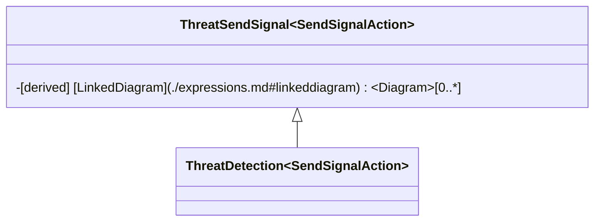

# Stereotypes

## CEMT Misuse Case Diagrams

### CyberActor

The `CyberActor` stereotype uses the `Actor` class as a metaclass, and provides a labelling stereotype for all `Actor`s used within the CEMT Misuse Case Diagrams. This aids with the formation of structured expressions and queries in the model, by differentiating the `CyberActor`s used in CEMT Misuse Case Diagrams from generic `Actor`s which may be used within a broader system model.


`CyberActor` contains no attributes or constraints, but acts as a generalised stereotype for both the `MaliciousActor` and `NonMaliciousActor` stereotypes.

#### MaliciousActor

The `MaliciousActor` stereotype uses the `Actor` class as a metaclass, inherits from the `CyberActor` stereotype and provides a labelling stereotype for all `CyberActor`s used in CEMT Misuse Case Diagrams that have malicious intent. This aids with the formation of structured expressions and queries in the model, by differentiating the `MaliciousActor`s from other `CyberActor`s.


`MaliciousActor` contains no attributes or constraints, but inherits from the `CyberActor` stereotype.

#### NonMaliciousActor

The `NonMaliciousActor` stereotype uses the `Actor` class as a metaclass, inherits from the `CyberActor` stereotype and provides a labelling stereotype for all `CyberActor`s used in CEMT Misuse Case Diagrams that do not have malicious intent. This aids with the formation of structured expressions and queries in the model, by differentiating the `NonMaliciousActor`s from other `CyberActor`s.


`MaliciousActor` contains no attributes or constraints, but inherits from the `CyberActor` stereotype.

### MisuseCase

The `MisuseCase` stereotype uses the `UseCase` class as a metaclass and provides a stereotype for the misuse cases used in CEMT Misuse Case Diagrams. This aids with the formation of structured expressions and queries in the model, by differentiating the `MisuseCase`s from other `UseCase`s. The `MisuseCase` stereotype also defines constraints which are used by the active validation suite in the CEMT to provide automated review of this stereotype and its related objects to aid both modellers and reviewers.


`MisuseCase` contains no attributes, but has two active validation constraints:
 - Name() - which checks that the name of the `MisuseCase` and the name of the `MalActivity` which classifies its behaviour are equal; and
 - Mal-Activities() - which checks that the `Activity` which classifies the `MisuseCases` behaviour is stereotyped as a `MalActivity`.

### Association

This is the built-in `Association` class within CAMEO System Modeler. Further detail can be found in the CAMEO documentation on their website.

## CEMT Mal-Activity Diagrams

### ThreatStart

The `ThreatStart` stereotype uses the `InitialNode` class as a metaclass and provides a stereotype for all `InitialNode`s used in the CEMT Mal-Activity Diagrams. This aids with the formation of structured expressions and queries in the model, by differentiating the `ThreatStart`s from other `InitialNode`s which may be used within a broader system model.


`ThreatStart` contains a single derived property:
 - NextThreatAction - which traverses the `ThreatFlow`s to determine which `ThreatAction`s are connected to this `ThreatStart`.

### ThreatEnd

The `ThreatEnd` stereotype uses the `FlowFinalNode` class as a metaclass and provides a labelling stereotype for all `FlowFinalNode`s used in the CEMT Mal-Activity Diagrams. This aids with the formation of structured expressions and queries in the model, by differentiating the `ThreatEnd`s from other `FlowFinalNode`s which may be used within a broader system model.


`ThreatEnd` contains no attributes or constraints.

### AggregatedAction

The `AggregatedAction` stereotype uses the `CallBehaviorAction` class as a metaclass and provides a stereotype for the actions used in CEMT Mal-Activity Diagrams that have nested content below them. This aids with the formation of structured expressions and queries in the model, by differentiating the `AggregatedAction`s from other `CallBehaviorAction`s. The `AggregatedAction` stereotype also defines constraints which are used by the active validation suite in the CEMT to provide automated review of this stereotype and its related objects to aid both modellers and reviewers.


`AggregatedAction` contains no attributes, but has three active validation constraints:
 - Name() - which checks that the name of the `AggregatedAction` and the name of the `MalActivity` which classifies its behaviour are equal;
 - Mal-Activities() - which checks that the `Activity` which classifies the `AggregatedAction` behaviour is stereotyped as a `MalActivity`; and
 - Nodes() - which checks that the `ActivityParameterNodes` within the the `Activity` which classifies the `AggregatedAction` behaviour have the `isControlType` flag set, allowing them to be connected by `ThreatModelFlow`s.

`AggregatedAction` also has a related stereotype `Customization` which sets the CEMT Mal-Activity Diagram as a `Suggested Owned Diagram`, which allows the CEMT Mal-Activity Diagram to appear in the context menu shortcuts associated with `AggregatedAction`s.

### ThreatInput

The `ThreatInput` stereotype uses the `InputPin` class as a metaclass and provides a labelling stereotype for all `InputPin`s used in the CEMT Mal-Activity Diagrams. This aids with the formation of structured expressions and queries in the model, by differentiating the `ThreatInput`s from other `InputPin`s which may be used within a broader system model.


`ThreatInput` contains no attributes or constraints.

### ThreatOutput

The `ThreatOutput` stereotype uses the `OutputPin` class as a metaclass and provides a labelling stereotype for all `OutputPin`s used in the CEMT Mal-Activity Diagrams. This aids with the formation of structured expressions and queries in the model, by differentiating the `ThreatOutput`s from other `OutputPin`s which may be used within a broader system model.


`ThreatOutput` contains no attributes or constraints.

### ThreatModelFlow

The `ThreatModelFlow` stereotype uses the `ControlFlow` class as a metaclass, and provides a labelling stereotype for all `ControlFlow`s used within the CEMT Mal-Activity Diagrams. This aids with the formation of structured expressions and queries in the model, by differentiating the `ThreatModelFlow`s used in CEMT Mal-Activity Diagrams from generic `ControlFlow`s which may be used within a broader system model.


`ThreatModelFlow` contains no attributes or constraints, but acts as a generalised stereotype for both the `ThreatFlow` and `DetectionFlow` stereotypes.

#### ThreatFlow

The `ThreatFlow` stereotype uses the `ControlFlow` class as a metaclass, and provides a labelling stereotype for all `ControlFlow`s used in the CEMT Mal-Activity Diagrams that are associated with a `CyberActor`s actions against the system. This aids with the formation of structured expressions and queries in the model, by differentiating the `ThreatFlow`s used in CEMT Mal-Activity Diagrams from other `ThreatModelFlow`s.


`ThreatFlow` contains no attributes or constraints, but inherits from the `ThreatModelFlow` stereotype.

#### DetectionFlow

The `DetectionFlow` stereotype uses the `ControlFlow` class as a metaclass, aand provides a labelling stereotype for all `ControlFlow`s used in the CEMT Mal-Activity Diagrams that are associated with the system's detection capabilities. This aids with the formation of structured expressions and queries in the model, by differentiating the `DetectionFlow`s used in CEMT Mal-Activity Diagrams from other `ThreatModelFlow`s.


`DetectionFlow` contains no attributes or constraints, but inherits from the `ThreatModelFlow` stereotype.

### ThreatSignal

The `ThreatSignal` stereotype uses the `Signal` class as a metaclass, and provides a labelling stereotype for all `Signal`s used within the CEMT Mal-Activity Diagrams. This aids with the formation of structured expressions and queries in the model, by differentiating the `ThreatSignal`s used in CEMT Mal-Activity Diagrams from generic `Signal`s which may be used within a broader system model.


`ThreatSignal` contains no attributes or constraints, but acts as a generalised stereotype for both the `ThreatImpactSignal` and `ThreatDetectionSignal` stereotypes.

`ThreatSignal` also has a related stereotype `Customization` which sets the `Package` metaclass as a `Possible Owner` and the `Signal` metaclass as a `Quick Applying For` property, which allows the `ThreatSignal` stereotype to appear when creating elements under a `Package` and in the context menu for a `Signal`, respectively.

#### ThreatImpactSignal

The `ThreatImpactSignal` stereotype uses the `Signal` class as a metaclass, and provides a stereotype for all `Signal`s used within the CEMT Mal-Activity Diagrams that relate to an adverse impact on the system. This aids with the formation of structured expressions and queries in the model, by differentiating the `ThreatImpactSignal`s used in CEMT Mal-Activity Diagrams from generic `ThreatSignal`s.


`ThreatImpactSignal` contains a single derived property:
 - [PreviousThreatAction](./expressions.md#previousthreataction) - which traverses the `ThreatFlow`s in reverse to determine which `ThreatAction`s are connected to this `ThreatImpactSignal`.

`ThreatImpactSignal` inherits from the `ThreatSignal` stereotype.

`ThreatImpactSignal` also has a related stereotype `Customization` which sets the `Package` metaclass as a `Possible Owner` and both the `Signal` metaclass and the `ThreatSignal` stereotype as `Quick Applying For` properties, which allows the `ThreatImpactSignal` stereotype to appear when creating elements under a `Package` and in the context menu for both a `Signal` and `ThreatSignal`.

#### ThreatDetectionSignal

The `ThreatDetectionSignal` stereotype uses the `Signal` class as a metaclass, and provides a stereotype for all `Signal`s used within the CEMT Mal-Activity Diagrams that relate to the system detecting an adversary's actions. This aids with the formation of structured expressions and queries in the model, by differentiating the `ThreatDetectionSignal`s used in CEMT Mal-Activity Diagrams from generic `ThreatSignal`s.


`ThreatDetectionSignal` contains a single derived property:
 - [PreviousDetectionAction](./expressions.md#previousdetectionaction) - which traverses the `DetectionFlow`s in reverse to determine which `DetectionAction`s are connected to this `ThreatDetectionSignal`.

`ThreatDetectionSignal` inherits from the `ThreatSignal` stereotype.

`ThreatDetectionSignal` also has a related stereotype `Customization` which sets the `Package` metaclass as a `Possible Owner` and both the `Signal` metaclass and the `ThreatSignal` stereotype as `Quick Applying For` properties, which allows the `ThreatDetectionSignal` stereotype to appear when creating elements under a `Package` and in the context menu for both a `Signal` and `ThreatSignal`.

### ThreatSendSignal

The `ThreatSendSignal` stereotype uses the `SendSignalAction` class as a metaclass, and provides a stereotype for all `SendSignalAction`s used within the CEMT Mal-Activity Diagrams. This aids with the formation of structured expressions and queries in the model, by differentiating the `ThreatSendSignal`s used in CEMT Mal-Activity Diagrams from generic `SendSignalAction`s which may be used within a broader system model.


`ThreatSendSignal` contains a single derived property:
 - [LinkedDiagram](./expressions.md#linkeddiagram) - which lists the `Diagram`s which contains the `ThreatAcceptEvent`s that are linked to this `ThreatSendSignal` by the `ThreatSignal` that they share.

`ThreatSendSignal`acts as a generalised stereotype for both the `ThreatImpact` and `ThreatDetection` stereotypes.

`ThreatSendSignal` also has a related stereotype `Customization` which sets the `SendSignalAction` metaclass as a `Quick Applying For` property, which allows the `ThreatSendSignal` stereotype to appear in the context menu for a `SendSignalAction`.

#### ThreatImpact

The `ThreatImpact` stereotype uses the `SendSignalAction` class as a metaclass, and provides a labelling stereotype for all `ThreatSendSignal`s used within the CEMT Mal-Activity Diagrams that relate to an adverse impact on the system. This aids with the formation of structured expressions and queries in the model, by differentiating the `ThreatImpact`s used in CEMT Mal-Activity Diagrams from other `ThreatSendSignal`s.


`ThreatImpact` contains no attributes or constraints, but inherits from the `ThreatSendSignal` stereotype.

`ThreatSendSignal` also has a related stereotype `Customization` which sets the `SendSignalAction` metaclass as a `Quick Applying For` property, which allows the `ThreatImpact` stereotype to appear in the context menu for a `SendSignalAction`.

#### ThreatDetection

The `ThreatDetection` stereotype uses the `SendSignalAction` class as a metaclass, and provides a labelling stereotype for all `ThreatSendSignal`s used within the CEMT Mal-Activity Diagrams that relate to the system detecting an adversary's actions. This aids with the formation of structured expressions and queries in the model, by differentiating the `ThreatDetection`s used in CEMT Mal-Activity Diagrams from other `ThreatSendSignal`s.



`ThreatDetection` contains no attributes or constraints, but inherits from the `ThreatSendSignal` stereotype.

`ThreatSendSignal` also has a related stereotype `Customization` which sets the `SendSignalAction` metaclass as a `Quick Applying For` property, which allows the `ThreatDetection` stereotype to appear in the context menu for a `SendSignalAction`.

### ThreatAcceptEvent

The `ThreatAcceptEvent` stereotype uses the `AcceptEventAction` class as a metaclass, and provides a labelling stereotype for all `AcceptEventAction`s used within the CEMT Mal-Activity Diagrams. This aids with the formation of structured expressions and queries in the model, by differentiating the `ThreatAcceptEvent`s used in CEMT Mal-Activity Diagrams from other `AcceptEventAction`s.


`ThreatAcceptEvent` contains a single derived property:
 - [LinkedDiagram](./expressions.md#linkeddiagram) - which lists the `Diagram`s which contains the `ThreatSendSignal`s that are linked to this `ThreatAcceptEvent` by the `ThreatSignal` that they share.

`ThreatAcceptEvent` also has a related stereotype `Customization` which sets the `AcceptEventAction` metaclass as a `Quick Applying For` property, which allows the `ThreatAcceptEvent` stereotype to appear in the context menu for a `AcceptEventAction`.

### ThreatModelAction

The `ThreatModelAction` stereotype uses the `CallBehaviorAction` class as a metaclass, and provides a stereotype for all `CallBehaviorAction`s used within the CEMT Mal-Activity Diagrams. This aids with the formation of structured expressions and queries in the model, by differentiating the `ThreatModelAction`s used in CEMT Mal-Activity Diagrams from generic `CallBehaviorAction`s which may be used within a broader system model.


`ThreatModelAction` contains six derived properties:
 - mitigatedBy - which lists the `SecurityControl`s which are linked to this `ThreatModelAction` by the `Mitigates` relationship;
 - affects - which lists the `Asset`s which are linked to this `ThreatModelAction` by the `Affects` relationship;
 - Implemented Controls - which lists the `SecurityProperty`s associated with this `ThreatModelAction` that have an `Implementation` status of `Implemented`;
 - Not Implemented Controls - which lists the `SecurityProperty`s associated with this `ThreatModelAction` that have an `Implementation` status of ` Not Implemented`;
 - Partially Implemented Controls - which lists the `SecurityProperty`s associated with this `ThreatModelAction` that have an `Implementation` status of `Partially Implemented`; and
 - Not Assessed Controls - which lists the `SecurityProperty`s associated with this `ThreatModelAction` that have an `Implementation` status of `Not Assessed`.

`ThreatModelAction`acts as a generalised stereotype for both the `ThreatAction` and `DetectionAction` stereotypes.

`ThreatModelAction` also has a related stereotype `Customization` which sets the `affects` and `mitigatedBy` properties as `Properties Displayed In Compartments`, which causes the `affects` and `mitigatedBy` properties to appear on `ThreatModelAction` shapes in the CEMT Mal-Activity Diagrams.

#### ThreatAction

The `ThreatAction` stereotype uses the `CallBehaviorAction` class as a metaclass, and provides a stereotype for all `ThreatModelAction`s used within the CEMT Mal-Activity Diagrams that relate to the actions of an adversary. This aids with the formation of structured expressions and queries in the model, by differentiating the `ThreatAction`s used in CEMT Mal-Activity Diagrams from generic `ThreatModelAction`s.

```mermaid
    classDiagram
        class ThreatModelAction~CallBehaviorAction~ { 
            +[derived] mitigatedBy~Element~ [0..*]    
            +[derived] affects~Element~ [0..*]  
            +[derived] Implemented Controls~Property~[0..*]
            +[derived] Not Implemented Controls~Property~[0..*]
            +[derived] Partially Implemented Controls~Property~[0..*]
            +[derived] Not Assessed Controls~Property~[0..*]
        }
        class ThreatAction~CallBehaviorAction~ { 
            +Difficulty~Difficulty~     
            -[derived] NextThreatAction~RedefinableElement~[0..*]
            -[derived] PreviousThreatAction~RedefinableElement~[0..*]
            -[derived] DetectionAction~ActivityNode~[0..*]
            -[constraint] Assets()
            -[constraint] Controls()
            -[constraint] Difficulty()
            -[constraint] Incoming()
            -[constraint] OutgoingDet()
            -[constraint] OutgoingThreat()
            -[constraint] Properties()
        }
        ThreatModelAction~CallBehaviorAction~ <|-- ThreatAction~CallBehaviorAction~
```

`ThreatAction` contains one tagged value:
 - Difficulty - which captures the difficulty of the adversary action in absence of any mitigating controls, using the [Difficulty](./enumerations.md#difficulty) enumeration.

`ThreatAction` contains three derived properties:
 - [NextThreatAction](./expressions.md#nextthreataction) - which traverses the `ThreatFlow`s to determine which other `ThreatAction`s are connected to this `ThreatAction`;
 - [PreviousThreatAction](./expressions.md#previousthreataction) - which traverses the `ThreatFlow`s in reverse to determine which other `ThreatAction`s are connected to this `ThreatAction`; and
 - [DetectionAction](./expressions.md#detectionaction) - which traverses the `DetectionFlow`s to determine which `DetectionAction`s are connected to this `ThreatAction`.

`ThreatAction` inherits from the `ThreatModelAction` stereotype.

`ThreatAction`has seven active validation constraints:
 - Assets() - which checks whether there are any `Asset`s linked to this `ThreatAction` and flags if there are no linked `Asset`s;
 - Controls() - which checks whether there are any `SecurityControl`s linked to this `ThreatAction` and flags if there are no linked `SecurityControl`s;
 - Difficulty() - which checks whether the Difficulty property has been set for the `ThreatAction`;
 - Incoming() - which checks whether there is a `ThreatFlow` coming into this `ThreatAction`;
 - OutgoingDet() - which checks whether there is a `DetectionFlow` leaving this `TheatAction`;
 - OutgoingThreat() - which checks whether there is a `ThreatFlow` leaving this `TheatAction`; and
 - Properties() - which checks whether all of the `SecurityProperty`s implied by the linked `Asset`s and `SecurityControl`s have been created in the model.

#### DetectionAction

The `DetectionAction` stereotype uses the `CallBehaviorAction` class as a metaclass, and provides a stereotype for all `ThreatModelAction`s used within the CEMT Mal-Activity Diagrams that relate to the system's detection response to an adversary. This aids with the formation of structured expressions and queries in the model, by differentiating the `DetectionAction`s used in CEMT Mal-Activity Diagrams from generic `ThreatModelAction`s.

```mermaid
    classDiagram
        class ThreatModelAction~CallBehaviorAction~ { 
            +[derived] mitigatedBy~Element~ [0..*]    
            +[derived] affects~Element~ [0..*]  
            +[derived] Implemented Controls~Property~[0..*]
            +[derived] Not Implemented Controls~Property~[0..*]
            +[derived] Partially Implemented Controls~Property~[0..*]
            +[derived] Not Assessed Controls~Property~[0..*]
        }
        class DetectionAction~CallBehaviorAction~ {      
            -[constraint] Assets()
            -[constraint] Controls()
            -[constraint] Incoming()
            -[constraint] OutgoingDet()
            -[constraint] Properties()
        }
        ThreatModelAction~CallBehaviorAction~ <|-- DetectionAction~CallBehaviorAction~
```

`DetectionAction` inherits from the `ThreatModelAction` stereotype.

`DetectionAction`has five active validation constraints:
 - Assets() - which checks whether there are any `Asset`s linked to this `DetectionAction` and flags if there are no linked `Asset`s;
 - Controls() - which checks whether there are any `SecurityControl`s linked to this `DetectionAction` and flags if there are no linked `SecurityControl`s;
 - Incoming() - which checks whether there is a `DetectionFlow` coming into this `DetectionAction`;
 - OutgoingDet() - which checks whether there is a `DetectionFlow` leaving this `DetectionAction`; and
 - Properties() - which checks whether all of the `SecurityProperty`s implied by the linked `Asset`s and `SecurityControl`s have been created in the model.

### MalActivity

The `MalActivity` stereotype uses the `Activity` class as a metaclass and provides a labelling stereotype for all `Activity`s used in the CEMT Mal-Activity Diagrams. This aids with the formation of structured expressions and queries in the model, by differentiating the `MalActivity`s from generic `Activity`s which may be used within a broader system model.

```mermaid
    classDiagram
        class MalActivity~Activity~
```

`MalActivity` contains no attributes or constraints.

`MalActivity` also has a related stereotype `Customization` which sets the `Activity` metaclass as a `Quick Applying For` property, which allows the `MalActivity` stereotype to appear in the context menu for an `Activity`. It also sets the `MisuseCase`, `Package` and `AggregatedAction` stereotypes as `Possible Owners` which allows the `MalActivity` stereotype to appear when creating elements under a `Package`, `MisuseCase` or `AggregatedAction`.

## CEMT Asset Definition Diagram

### Asset

The `Asset` stereotype uses the `Class` class as a metaclass, and provides a stereotype for all `Block`s used within the CEMT Asset Definition Diagram. This aids with the formation of structured expressions and queries in the model, by differentiating the `Asset`s used in CEMT Mal-Activity Diagrams from generic `Block`s which may be used within a broader system model.

```mermaid
    classDiagram
        class Asset~Class~ {
            +[derived] affectedBy~Element~ [0..*]
            +[derived] applicable~Element~ [0..*]
            +[derived] Implemented Controls~Class~ [0..*]
            +[derived] Not Implemented Controls~Class~ [0..*]
            +[derived] Patially Implemented Controls~Class~ [0..*]
            +[derived] Not Assessed Controls~Class~ [0..*]
            +[derived] Implemented~Property~ [0..*]
            +[derived] Not Implemented~Property~ [0..*]
            +[derived] Patially Implemented~Property~ [0..*]
            +[derived] Not Assessed~Property~ [0..*]
            -[constraint] Affected()
            -[constraint] Applies()
        }
        Asset~Class~ <|-- System~Class~
        Asset~Class~ <|-- NoneAsset~Class~
        Block~Class~ <|-- Asset~Class~
```

`Asset` contains ten derived properties:
 - mitigatedBy - which lists the `SecurityControl`s which are linked to this `ThreatModelAction` by the `Mitigates` relationship;
 - affects - which lists the `Asset`s which are linked to this `ThreatModelAction` by the `Affects` relationship;
 - Implemented Controls - which lists the `SecurityControl`s related to this `Asset` that have an associated `SecurityProperty` with an `Implementation` status of `Implemented`;
 - Not Implemented Controls - which lists the `SecurityControl`s related to this `Asset` that have an associated `SecurityProperty` with an `Implementation` status of `Not Implemented`;
 - Partially Implemented Controls - which lists the `SecurityControl`s related to this `Asset` that have an associated `SecurityProperty` with an `Implementation` status of `Partially Implemented`;
 - Not Assessed Controls - which lists the `SecurityControl`s related to this `Asset` that have an associated `SecurityProperty` with an `Implementation` status of `Not Assessed`;
 - Implemented - which lists the `SecurityProperty`s associated with this `Asset` that have an `Implementation` status of `Implemented`;
 - Not Implemented - which lists the `SecurityProperty`s associated with this `Asset` that have an `Implementation` status of `Not Implemented`;
 - Partially Implemented - which lists the `SecurityProperty`s associated with this `Asset` that have an `Implementation` status of `Partially Implemented`; and
 - Not Assessed - which lists the `SecurityProperty`s associated with this `Asset` that have an `Implementation` status of `Not Assessed`.

`Asset` has two active validation constraints:
 - Affected() - which checks whether there are any `SecurityControl`s linked to the same `ThreatModelAction` as this `Asset` that do not have a corresponding `SecurityProperty` and flags if there are none; and
 - Applies() - which checks whether there are any `SecurityConstraint`s linked to this `Asset` that do not have a corresponding `SecurityProperty` and flags if there are none.

`Asset` acts as a generalised stereotype for both the `System` and `NoneAsset` stereotypes.

`Asset` also has a related stereotype `Customization` which sets the `Implemented Controls`, `Not Implemented Controls`, `Patially Implemented Controls` and `Not Assessed Controls` properties as `Properties Displayed In Compartments`, which causes those properties to appear on `Asset` shapes in the CEMT Asset Definition Diagrams. It also sets the `Package` stereotype as `Possible Owners` which allows the `Asset` stereotype to appear when creating elements under a `Package`.

#### System

The `System` stereotype uses the `Class` class as a metaclass, and provides a stereotype for the `Asset` used within the CEMT Asset Definition Diagram that represents the system of interest which is the focus of the assessment. This aids with the formation of structured expressions and queries in the model, by differentiating the `Asset` that represents the system of interest from other `Asset`s used within the threat model.

```mermaid
    classDiagram
        class Asset~Class~ {
            +[derived] affectedBy~Element~ [0..*]
            +[derived] applicable~Element~ [0..*]
            +[derived] Implemented Controls~Class~ [0..*]
            +[derived] Not Implemented Controls~Class~ [0..*]
            +[derived] Patially Implemented Controls~Class~ [0..*]
            +[derived] Not Assessed Controls~Class~ [0..*]
            +[derived] Implemented~Property~ [0..*]
            +[derived] Not Implemented~Property~ [0..*]
            +[derived] Patially Implemented~Property~ [0..*]
            +[derived] Not Assessed~Property~ [0..*]
            -[constraint] Affected()
            -[constraint] Applies()
        }
        Asset~Class~ <|-- System~Class~
```

`System` contains no attributes or constraints, but inherits from the `Asset` stereotype.

#### NoneAsset

The `NoneAsset` stereotype uses the `Class` class as a metaclass, and provides a stereotype for a null `Asset` which is used when a `SecurityContraint` is not applicable to any `Asset`s. This aids with the formation of structured expressions and queries in the model, by differentiating the `NoneAsset` that represents the lack of an applicable asset from other `Asset`s used within the threat model.

```mermaid
    classDiagram
        class Asset~Class~ {
            +[derived] affectedBy~Element~ [0..*]
            +[derived] applicable~Element~ [0..*]
            +[derived] Implemented Controls~Class~ [0..*]
            +[derived] Not Implemented Controls~Class~ [0..*]
            +[derived] Patially Implemented Controls~Class~ [0..*]
            +[derived] Not Assessed Controls~Class~ [0..*]
            +[derived] Implemented~Property~ [0..*]
            +[derived] Not Implemented~Property~ [0..*]
            +[derived] Patially Implemented~Property~ [0..*]
            +[derived] Not Assessed~Property~ [0..*]
            -[constraint] Affected()
            -[constraint] Applies()
        }
        Asset~Class~ <|-- NoneAsset~Class~
```

`NoneAsset` contains no attributes or constraints, but inherits from the `Asset` stereotype.

### DirectedAssociation

This is the built-in `DirectedAssociation` class within CAMEO System Modeler. Further detail can be found in the CAMEO documentation on their website.

## Dependency Matrix

### SecurityControl

The `SecurityControl` stereotype uses the `Requirement` class as a metaclass, and provides a stereotype for all security controls used within the CEMT process. `SecurityControl`s are used to identify any security mitigations which are linked to the `ThreatModelAction`s in the threat model.

```mermaid
    classDiagram
        class SecurityControl~Class~ {
            +Control Number
            +[derived] Mitigates~Element~ [0..*]
            +[derived] Implemented~Property~ [0..*]
            +[derived] Not Implemented~Property~ [0..*]
            +[derived] Patially Implemented~Property~ [0..*]
            +[derived] Not Assessed~Property~ [0..*]
            -[constraint] Description()
            -[constraint] Mitigates()
        }
        class SecurityConstraint~Class~ {
            +Constraint Number
            +[derived] Applies~Element~ [0..*]
            -[constraint] Description()
            -[constraint] Applies()
        }
        Requirement~Class~ <|-- SecurityControl~Class~
        SecurityControl~Class~ <|-- NoneControl~Class~
        SecurityControl~Class~ <|-- SecurityConstraint~Class~
```

`SecurityControl` contains a single attribute:
 - Control Number - which contains a unique identifier for the each `SecurityControl`.

`SecurityControl` contains five derived properties:
 - Mitigates - which lists the `ThreatModelAction`s which are linked to this `SecurityControl` by the `Mitigates` relationship;
 - Implemented - which lists the `SecurityProperty`s associated with this `SecurityControl` that have an `Implementation` status of `Implemented`;
 - Not Implemented - which lists the `SecurityProperty`s associated with this `SecurityControl` that have an `Implementation` status of `Not Implemented`;
 - Partially Implemented - which lists the `SecurityProperty`s associated with this `SecurityControl` that have an `Implementation` status of `Partially Implemented`; and
 - Not Assessed - which lists the `SecurityProperty`s associated with this `SecurityControl` that have an `Implementation` status of `Not Assessed`.

`SecurityControl` has two active validation constraints:
 - Description() - which checks whether the Control Description attribute is empty and flags if it is; and
 - Mitigates() - which checks whether there are any `ThreatModelAction`s linked to this `SecurityControl` and flags if there are none.

`SecurityControl` acts as a generalised stereotype for both the `SecurityConstraint` and `NoneControl` stereotypes.

`SecurityControl` also has a related stereotype `Customization` which renames the built-in `Documentation` attribute to be called `Control Description`. It also sets the `Package` stereotype as `Possible Owners` which allows the `Asset` stereotype to appear when creating elements under a `Package` and sets the `SecurityConstraint` stereotype as a `Quick Applying For` property, which allows the `SecurityControl` stereotype to appear in the context menu for a `SecurityConstraint`.

### NoneControl

The `NoneControl` stereotype uses the `Class` class as a metaclass, and provides a stereotype for a null `SecurityControl` which is used when a `ThreatModelAction` does not have any feasible security mitigations. This aids with the formation of structured expressions and queries in the model, by differentiating the `NoneControl` that represents the lack of an applicable security controls from other `SecurityControl`s used within the threat model.

```mermaid
    classDiagram
        class SecurityControl~Class~ {
            +Control Number
            +[derived] Mitigates~Element~ [0..*]
            +[derived] Implemented~Property~ [0..*]
            +[derived] Not Implemented~Property~ [0..*]
            +[derived] Patially Implemented~Property~ [0..*]
            +[derived] Not Assessed~Property~ [0..*]
            -[constraint] Description()
            -[constraint] Mitigates()
        }
        SecurityControl~Class~ <|-- NoneControl~Class~
```

`NoneControl` contains no attributes or constraints, but inherits from the `SecurityControl` stereotype.

#### SecurityConstraint

The `SecurityConstraint` stereotype uses the `Requirement` class as a metaclass, and provides a stereotype for all `SecurityControl`s that are included in the cyberworthiness analysis because they are constraints on the project - in the form of formal security requirements or compliance controls - rather than being derived from the `ThreatModelAction`s in the threat model. `SecurityConstraint`s are able to be linked directly to `Asset`s, rather than being linked to a `ThreatModelAction`. The use of `SecurityConstraint`s should be avoided unless it is absolutely necessary, as it undermines the inherent scoping of the security controls to the system that occurs when controls are derived from the threat model itself.

```mermaid
    classDiagram
        class SecurityControl~Class~ {
            +Control Number
            +[derived] Mitigates~Element~ [0..*]
            +[derived] Implemented~Property~ [0..*]
            +[derived] Not Implemented~Property~ [0..*]
            +[derived] Patially Implemented~Property~ [0..*]
            +[derived] Not Assessed~Property~ [0..*]
            -[constraint] Description()
            -[constraint] Mitigates()
        }
        class SecurityConstraint~Class~ {
            +Constraint Number
            +[derived] Applies~Element~ [0..*]
            -[constraint] Description()
            -[constraint] Applies()
        }
        class ISMControl~Class~ {
            +ISM Number
            +Revision~Integer~
            +Updated~String~
            +Applicability All~Boolean~
            +Applicability O~Boolean~
            +Applicability P~Boolean~
            +Applicability S~Boolean~
            +Applicability TS~Boolean~
            +E8 ML2~Boolean~
            +E8 ML3~Boolean~
            +ISM ID~String~
            +Guideline~String~
            +Section~String~
            +Topic~String~
        }
        SecurityControl~Class~ <|-- SecurityConstraint~Class~
        SecurityConstraint~Class~ <|-- ISMControl~Class~
```

`SecurityConstraint` contains a single attribute:
 - Constraint Number - which contains a unique identifier for the each `SecurityConstraint`.

`SecurityConstraint` contains one derived property:
 - Applies - which lists the `Asset`s which are linked to this `SecurityConstraint` by the `Applies` relationship.

`SecurityConstraint` has two active validation constraints:
 - Description() - which checks whether the Control Description attribute is empty and flags if it is; and
 - Applies() - which checks whether there are any `Asset`s linked to this `SecurityConstraint` and flags if there are none.

`SecurityConstraint` acts as a generalised stereotype for  the `ISMControl` stereotype.

`SecurityConstraint` also has a related stereotype `Customization` which renames the built-in `Documentation` attribute to be called `Control Description`. It also sets the `Package` stereotype as `Possible Owners` which allows the `SecurityConstraint` stereotype to appear when creating elements under a `Package` and sets the `SecurityControl` stereotype as a `Quick Applying For` property, which allows the `SecurityConstraint` stereotype to appear in the context menu for a `SecurityControl`.

##### ISMControl

The `ISMControl` stereotype uses the `Requirement` class as a metaclass, and provides a stereotype for all `SecurityControl`s that are imported from the Information Security Manual. This stereotype can be used as a template for other control catalogs that you may want to import into the model. As this stereotype inherits from both the `SecurityControl` and `SecurityConstraint` stereotypes, `ISMControl`s can be linked to either `ThreatModelAction`s or directly to `Asset`s. Where possible, they should be linked to `ThreatModelAction`s.

```mermaid
    classDiagram
        class SecurityConstraint~Class~ {
            +Constraint Number
            +[derived] Applies~Element~ [0..*]
            -[constraint] Description()
            -[constraint] Applies()
        }
        class ISMControl~Class~ {
            +ISM Number
            +Revision~Integer~
            +Updated~String~
            +Applicability All~Boolean~
            +Applicability O~Boolean~
            +Applicability P~Boolean~
            +Applicability S~Boolean~
            +Applicability TS~Boolean~
            +E8 ML2~Boolean~
            +E8 ML3~Boolean~
            +ISM ID~String~
            +Guideline~String~
            +Section~String~
            +Topic~String~
        }
        SecurityConstraint~Class~ <|-- ISMControl~Class~
```

`ISMControl` contains fourteen attributes:
 - ISM Number - which contains a unique identifier for the each `ISMControl`;
 - Revision - which captures the Revision attribute taken from the ISM, which identifies the current revision of the control;
 - Updated - which captures the Updated attribute taken from the ISM, which identifies when the control was last modified;
 - Applicability All - which captures the Applicability All attribute taken from the ISM, which identifies whether the control is applicable to all classifications;
 - Applicability O - which captures the Applicability O attribute taken from the ISM, which identifies whether the control is applicable to the Official classification;
 - Applicability P - which captures the Applicability P attribute taken from the ISM, which identifies whether the control is applicable to the Protected classification;
 - Applicability S - which captures the Applicability S attribute taken from the ISM, which identifies whether the control is applicable to the Secret classification;
 - Applicability TS - which captures the Applicability TS attribute taken from the ISM, which identifies whether the control is applicable to the Top Secret classification;
 - E8 ML2 - which captures the E8 ML2 attribute taken from the ISM, which identifies whether the control is required for Maturity Level 2 of the Essential Eight Maturity Model; 
 - E8 ML3 - which captures the E8 ML3 attribute taken from the ISM, which identifies whether the control is required for Maturity Level 3 of the Essential Eight Maturity Model;
 - ISM ID - which captures the ISM ID Number attribute taken from the ISM;
 - Guideline - which captures the Guideline heading under which the control is placed in the ISM;
 - Section - which captures the Section heading under which the control is placed in the ISM; and
 - Topic - which captures the Topic heading under which the control is placed in the ISM;

`ISMControl` also has a related stereotype `Customization` which sets the `SecurityConstraint` stereotype as a `Quick Applying For` property, which allows the `ISMControl` stereotype to appear in the context menu for a `SecurityConstraint`.

### Mitigates

The `Mitigates` stereotype uses the `Dependency` class as a metaclass, and provides a stereotype for the relationship that links `SecurityControl`s to the `ThreatModelAction`s they mitigate. This aids with the formation of structured expressions and queries in the model, by identifying the relationship between these `SecurityControl`s and `ThreatModelAction`s.

```mermaid
    classDiagram
        class Mitigates~Dependency~
```

`Mitigates` contains no attributes or constraints.

`Mitigates` has a related stereotype `Customization` which sets the `SecurityControl` stereotype as a `typesForSource` property and the `ThreatModelAction` stereotype as a `typesForTarget`, which allows the `Mitigates` relationship to appear be created between from a `SecurityControl` to a `ThreatModelAction`.

### Affects

The `Affects` stereotype uses the `Dependency` class as a metaclass, and provides a stereotype for the relationship that links `ThreatModelAction`s to the `Asset`s they affect. This aids with the formation of structured expressions and queries in the model, by identifying the relationship between these `ThreatModelAction`s and `Asset`s.

```mermaid
    classDiagram
        class Affects~Dependency~
```

`Affects` contains no attributes or constraints.

`Affects` has a related stereotype `Customization` which sets the `ThreatModelAction` stereotype as a `typesForSource` property and the `Asset` stereotype as a `typesForTarget`, which allows the `Mitigates` relationship to appear be created between from a `ThreatModelAction` to an `Asset`.

### Applies

The `Applies` stereotype uses the `Dependency` class as a metaclass, and provides a stereotype for the relationship that links `SecurityConstraint`s to the `Asset`s to which they apply. This aids with the formation of structured expressions and queries in the model, by identifying the relationship between these `SecurityConstraint`s and `Asset`s.

```mermaid
    classDiagram
        class Applies~Dependency~
```

`Applies` contains no attributes or constraints.

`Applies` has a related stereotype `Customization` which sets the `SecurityConstraint` stereotype as a `typesForSource` property and the `Asset` stereotype as a `typesForTarget`, which allows the `Mitigates` relationship to appear be created between from a `SecurityConstraint` to an `Asset`.

### SecurityProperty

The `SecurityProperty` stereotype uses the `Property` class as a metaclass, and provides a stereotype for all `Property`s that represent an instantiation of a `SecurityControl` onto an `Asset`. 

```mermaid
    classDiagram
        class SecurityProperty~Property~ {
            +Implementation~Implementation~ = Not Assessed
            +[derived] Control Description~String~ [1]
            -[constraint] Implementation()
            -[constraint] Implementation Detail()
            -[constraint] Type()
        }
```

`SecurityProperty` contains a single attribute:
 - Implementation - which tracks the implementation state of the `SecurityProperty`, using the [`Implementation`](./enumerations.md#implementation) enumeration as a type, with `Not Assessed` set as the Default Value.

`SecurityProperty` contains one derived property:
 - Control Description - which displays the `Control Description` attribute of the `SecurityControl` which is used as the Type of the `SecurityProperty`.

`SecurityProperty` has three active validation constraints:
 - Implementation() - which checks whether an Implementation state has been selected for this `SecurityProperty` and flags if it has not; 
 - Implementation Detail() - which checks whether the `SecurityProperty` has an Implementation state set, but no Implementation Detail recorded, and flags if that is true; and
 - Type() - which checks whether the `SecurityProperty` has a valid Type set, and will flag if it has not.

`SecurityProperty` also has a related stereotype `Customization` which renames the built-in `Documentation` attribute to be called `Implementation Detail`. It also sets the `Asset` stereotype as `Possible Owners` which allows the `SecurityProperty` stereotype to appear when creating elements under an `Asset`.

## SysML Parametric Diagrams

### SecurityRisk

The `SecurityRisk` stereotype uses the `Class` class as a metaclass, and provides a stereotype for all `Block`s used to represent the overall security risks tot he system of interest. This aids with the formation of structured expressions and queries in the model, by differentiating the `SecurityRisk`s used in the CEMT from other `Block`s used within the model.

```mermaid
    classDiagram
        class SecurityRisk~Class~ {
            +Likelihood~Likelihood~
            +Likelihood Justification~String~
            +Consequence~Consequence~
            +Consequence Justification~String~
            +Simulation Initial Probability~Real~
            +Simulation Residual Probability~Real~
            +Simulation Detection Probability~Real~
            +Simulation Threat Level~Threat~
            -[derived] Participating Asset~Class~ [0..1]
            -[derived] Threat Path~CallBehaviorAction~ [0..1]
            -[derived] Mitigating Controls~Element~ [0..1]
            -[derived] Potential Additional Controls~Element~ [0..1]
            -[derived] Detecting Controls~Element~ [0..1]
            -[derived] Risk Rating~Risk~ [0..1]
        }
        
        Block~Class~ <|-- SecurityRisk~Class~
```

`SecurityRisk` contains eight attributes:
 - Likelihood - which tracks the qualitative likelihood of the `SecurityRisk`, using the [`Likelihood`](./enumerations.md#likelihood) enumeration as a type;
 - Likelihood Justification - which provides a free-text field to capture the reasoning behind the allocation of the qualitative likelihood rating;
 - Consequence - which tracks the qualitative consequence of the `SecurityRisk`, using the [`Consequence`](./enumerations.md#consequence) enumeration as a type;
 - Consequence Justification - which provides a free-text field to capture the reasoning behind the allocation of the qualitative consequence rating;
 - Simulation Initial Probability - captures the quantitiate initial probability used in the simulation of the `SecurityRisk`;
 - Simulation Residual Probability - captures the quantitative residual risk probability resulting from the simulation of the `SecurityRisk`;
 - Simulation Detection Probability - captures the quantitative detection probability resulting from the simulation of the `SecurityRisk`; and
 - Simulation Threat Level - captures the threat level used in the simulation of the `SecurityRisk`, using the [`Threat`](./enumerations.md#threat) enumeration as a type.

`SecurityRisk` contains six derived properties:
 - Participating Asset - which lists the `Asset`s that are associated with this `SecurityRisk`;
 - Threat Path - which lists the `ThreatAction`s that are associated with this `SecurityRisk`;
 - Mitigating Controls - which lists the mitigating `SecurityControl`s associated with this `SecurityRisk`;
 - Potential Additional Controls - which lists the `SecurityControl`s that could be implemented to address this `SecurityRisk`, but which have not been implemented;
 - Detecting Controls - which lists the detecting `SecurityControl`s associated with this `SecurityRisk`; and
 - Risk Rating - which derives the qualitative risk of the `SecurityRisk` based on the `Likelihood` and `Consequence` attributes, using the [`Risk`](#risk) enumeration as a type.

`SecurityRisk` also has a related stereotype `Customization` which renames the built-in `Documentation` attribute to be called `Description`.

### ValueProperty

This is the built-in `ValueProperty` class within CAMEO System Modeler. Further detail can be found in the CAMEO documentation on their website.

#### ThreatLevel

The `ThreatLevel` stereotype uses the `Property` class as a metaclass, and provides a labelling stereotype for all `Property`s used within the SysML Parametric Diagrams that are associated with the threat level used in a `SecurityRisk` simulation.

```mermaid
    classDiagram
        ValueProperty~Property~ <|-- ThreatLevel~Property~
```

`ThreatLevel` contains no attributes or constraints and inherits from the built-in `ValueProperty` stereotype.

This value property is used in the `SecurityRisk` simulation to capture the skill and resource level of the threat actor attempting to enact the threat, and uses the [`Threat`](./enumerations.md#threat) enumeration for the values of the property. Modification of this value impacts the likelihood of the threat actor being able to perform `ThreatAction`s of a particular `Difficulty`, as well as the likelihood that the threat actor will evade detection. The [`Difficulty`](./constraints.md#difficulty) constraint block dictates the way in which the `ThreatLevel` impacts the quantitative likelihood that a threat actor will be able to complete an activity of a specific difficulty and the quantitative likelihood that a threat actor will be able to evade detection.

#### InitialProbability

The `InitialProbability` stereotype uses the `Property` class as a metaclass, and provides a labelling stereotype for all `Property`s used within the SysML Parametric Diagrams that are associated with the initial probability values used in a `SecurityRisk` simulation.

```mermaid
    classDiagram
        ValueProperty~Property~ <|-- InitialProbability~Property~
```

`InitialProbability` contains no attributes or constraints and inherits from the built-in `ValueProperty` stereotype.

This value property is used in the `SecurityRisk` simulation to capture the quantitative likelihood that the threat will be attempted, expressed as a percentage. For an engineering risk assessment of the system design, this should be set to `100`, whereas operational risk assessments that are seeking to capture the residual risk of a particular mission or mission set, should set the `InitialProbability` value to a percentage that represents the expected likelihood of the threat being attempted during that mission or mission set.

#### ResidualProbability

The `ResidualProbability` stereotype uses the `Property` class as a metaclass, and provides a labelling stereotype for all `Property`s used within the SysML Parametric Diagrams that are associated with the residual probability values used in a `SecurityRisk` simulation.

```mermaid
    classDiagram
        ValueProperty~Property~ <|-- ResidualProbability~Property~
```

`ResidualProbability` contains no attributes or constraints and inherits from the built-in `ValueProperty` stereotype.

This value property is used in the `SecurityRisk` simulation to capture the quantitative likelihood that the threat will be successful and the risk will be realised, expressed as a percentage. This is one of the primary outputs of the `SecurityRisk` simulation.

#### DetectionProbability

The `DetectionProbability` stereotype uses the `Property` class as a metaclass, and provides a labelling stereotype for all `Property`s used within the SysML Parametric Diagrams that are associated with the detection probability values used in a `SecurityRisk` simulation.

```mermaid
    classDiagram
        ValueProperty~Property~ <|-- DetectionProbability~Property~
```

`DetectionProbability` contains no attributes or constraints and inherits from the built-in `ValueProperty` stereotype.

This value property is used in the `SecurityRisk` simulation to capture the quantitative likelihood that the threat will be detected by the system 
*if* the attack is attempted, expressed as a percentage. This is one of the primary outputs of the `SecurityRisk` simulation. The [`DetectX`](./constraints.md#detectx) constraint blocks dictate the way in which the overall `DetectionProbability` is calculated.

#### DetectionControlEffectiveness

The `DetectionControlEffectiveness` stereotype uses the `Property` class as a metaclass, and provides a labelling stereotype for all `Property`s used within the SysML Parametric Diagrams that are associated with the effectiveness of detection controls used in a `SecurityRisk` simulation.

```mermaid
    classDiagram
        ValueProperty~Property~ <|-- DetectionControlEffectiveness~Property~
```

`DetectionControlEffectiveness` contains no attributes or constraints and inherits from the built-in `ValueProperty` stereotype.

This value property is used in the `SecurityRisk` simulation to capture the effectiveness of a particular set of `SecurityProperty`s in completing a particular `DetectionAction`. These control effectiveness values have some uncertainty around them, so they are defined by the modeller as a uniform distribution between a `min` and `max` value, which should both be expressed as a percentage. Modification of this value impacts the likelihood of the threat actor being detected while attempting to perform a `ThreatAction`. The [`Detect`](./constraints.md#detect) constraint block dictates the way in which the `DetectionControlEffectiveness` impacts the quantitative likelihood that a threat actor will be detected.

#### MitigationControlEffectiveness

The `MitigationControlEffectiveness` stereotype uses the `Property` class as a metaclass, and provides a labelling stereotype for all `Property`s used within the SysML Parametric Diagrams that are associated with the effectiveness of mitigating controls used in a `SecurityRisk` simulation.

```mermaid
    classDiagram
        ValueProperty~Property~ <|-- MitigationControlEffectiveness~Property~
```

`MitigationControlEffectiveness` contains no attributes or constraints and inherits from the built-in `ValueProperty` stereotype.

This value property is used in the `SecurityRisk` simulation to capture the effectiveness of a particular set of `SecurityProperty`s in preventing a particular `ThreatAction`. These control effectiveness values have some uncertainty around them, so they are defined by the modeller as a uniform distribution between a `min` and `max` value, which should both be expressed as a percentage. Modification of this value impacts the likelihood of the threat actor completing a `ThreatAction`. The [`Threat`](./constraints.md#threat) constraint block dictates the way in which the `MitigationControlEffectiveness` impacts the quantitative likelihood that a threat actor will be detected.

#### difficultyProperty

The `difficultyProperty` stereotype uses the `Property` class as a metaclass, and provides a labelling stereotype for all `Property`s used within the SysML Parametric Diagrams that are associated with the difficulty input parameters used in a `SecurityRisk` simulation.

```mermaid
    classDiagram
        ValueProperty~Property~ <|-- difficultyProperty~Property~
```

`difficultyProperty` contains no attributes or constraints and inherits from the built-in `ValueProperty` stereotype.

This value property is used in the `SecurityRisk` simulation to capture the likelihood that particular threats will be able to perform an action of a particular difficulty. These difficulty values have some uncertainty around them, so they are defined by the modeller as a uniform distribution between a `min` and `max` value, which should both be expressed as a percentage. Modification of this value impacts the likelihood of a given threat actor being able to perform `ThreatAction`s of a particular `Difficulty`, as well as the likelihood that the threat actor will evade detection. The [`Difficulty`](./constraints.md#difficulty) constraint block dictates the way in which a `difficultyProperty` impacts the quantitative likelihood that a threat actor will be able to complete an activity of a specific difficulty and the quantitative likelihood that a threat actor will be able to evade detection.

### ConstraintProperty

This is the built-in `ConstraintProperty` class within CAMEO System Modeler. Further detail can be found in the CAMEO documentation on their website.

#### ThreatConstraint

The `ThreatConstraint` stereotype uses the `Property` class as a metaclass, and provides a labelling stereotype for all `Property`s used within the SysML Parametric Diagrams that are associated with the `ThreatAction`s used in a `SecurityRisk` simulation.

```mermaid
    classDiagram
        ConstraintProperty~Property~ <|-- ThreatConstraint~Property~
```

`ThreatConstraint` contains no attributes or constraints and inherits from the built-in `ConstraintProperty` stereotype.

This value property is used in the `SecurityRisk` simulation to represent the `ThreatAction`s that an attacker needs to take to realise the risk, and contributes to the calculation of the overall residual risk. The [`Threat`](./constraints.md#threat) constraint block is used to type these `ThreatConstraint`s, which determines the way the inputs to the `ThreatConstraint` are transformed into the outputs of the `ThreatConstraint`.

#### DetectConstraint

The `DetectConstraint` stereotype uses the `Property` class as a metaclass, and provides a labelling stereotype for all `Property`s used within the SysML Parametric Diagrams that are associated with the `DetectionAction`s used in a `SecurityRisk` simulation and the calculation of the overall detection likelihood.

```mermaid
    classDiagram
        ConstraintProperty~Property~ <|-- DetectConstraint~Property~
```

`DetectConstraint` contains no attributes or constraints and inherits from the built-in `ConstraintProperty` stereotype.

This value property is used in two way in the `SecurityRisk` simulation:
 - to represent the `DetectionAction`s where the attacker might be detected; and
 - to combine the likelihood of the attacker being detected at each node into an overall detection probability.
The [`Detect`](./constraints.md#detect) constraint block is used to type these `DetectConstraint`s when they are representing a `DetectionAction` and the [`DetectX`](./constraints.md#detectx) constraint block is used to type these `DetectConstraint`s when they are being used to combine indivudal detection probabilities into an overall detection probability. Thes constraint blocks determine the way the inputs to the `DetectConstraint` are transformed into the outputs of the `DetectConstraint`.

#### DifficultyConstraint

The `DifficultyConstraint` stereotype uses the `Property` class as a metaclass, and provides a labelling stereotype for all `Property`s used within the SysML Parametric Diagrams that are associated with the calcuklation of difficulty likelihoods used in a `SecurityRisk` simulation.

```mermaid
    classDiagram
        ConstraintProperty~Property~ <|-- ThreatConstraint~Property~
```

`DifficultyConstraint` contains no attributes or constraints and inherits from the built-in `ConstraintProperty` stereotype.

This value property is used in the `SecurityRisk` simulation to convert the input `ThreatLevel` and `DifficultyProperty`s into a likelihood that the simualted attacker will be able to complete a `ThreatAction` of a particular difficulty. The [`Difficulty`](./constraints.md#difficulty) constraint block is used to type these `DifficultyConstraint`s, which determines the way the inputs to the `DifficultyConstraint` are transformed into the outputs of the `DifficultyConstraint`.