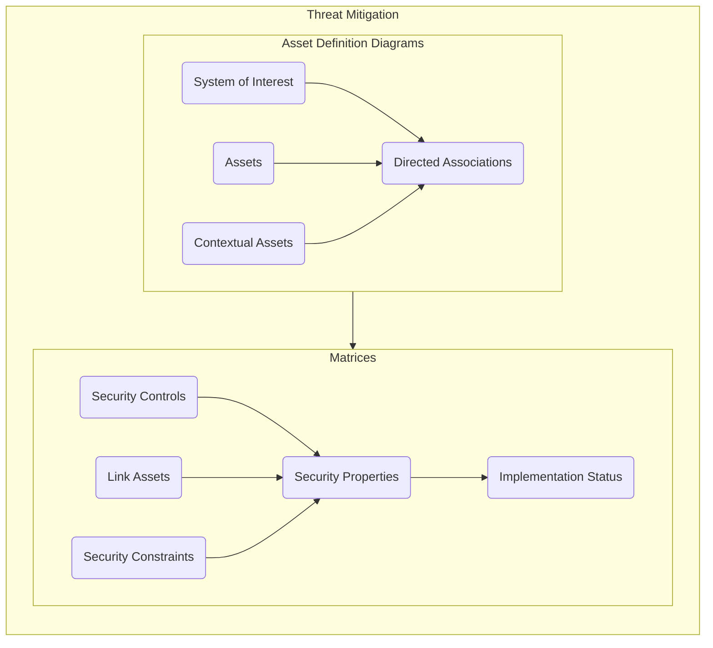
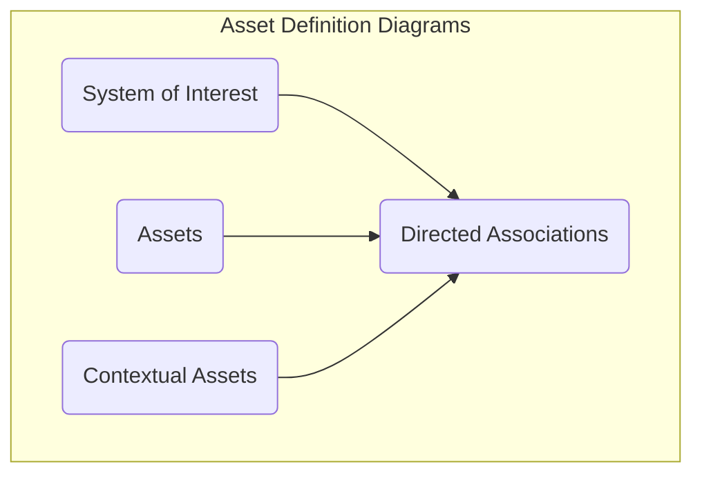
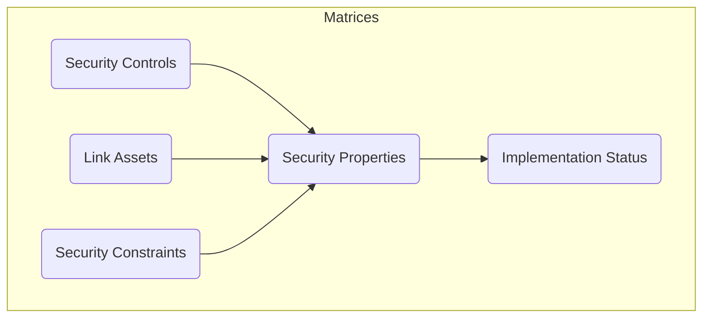

# Threat Mitigation

The threat mitigation stage involves the allocation of Security Controls and Assets to the threat model developed in the [Threat Modelling](./threat-modelling.md) stage. The purpose of this activity is to describe potential mitigations against the previously identified threat paths, allocate those mitigations to specific system assets and document the implementation state of those mitigations.

## Overview

## Asset Definition Diagrams

## Matrices

 > [Return to Modelling Process Flowchart](/README.md#threat-mitigation)