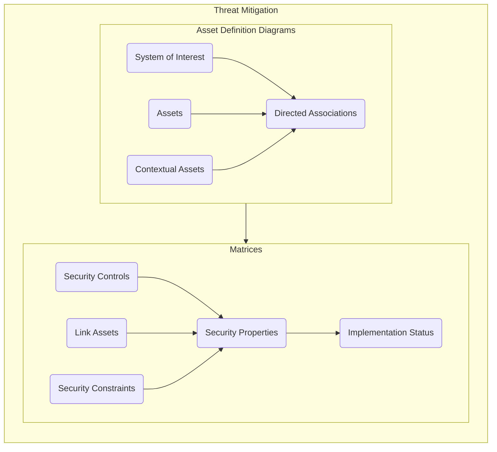
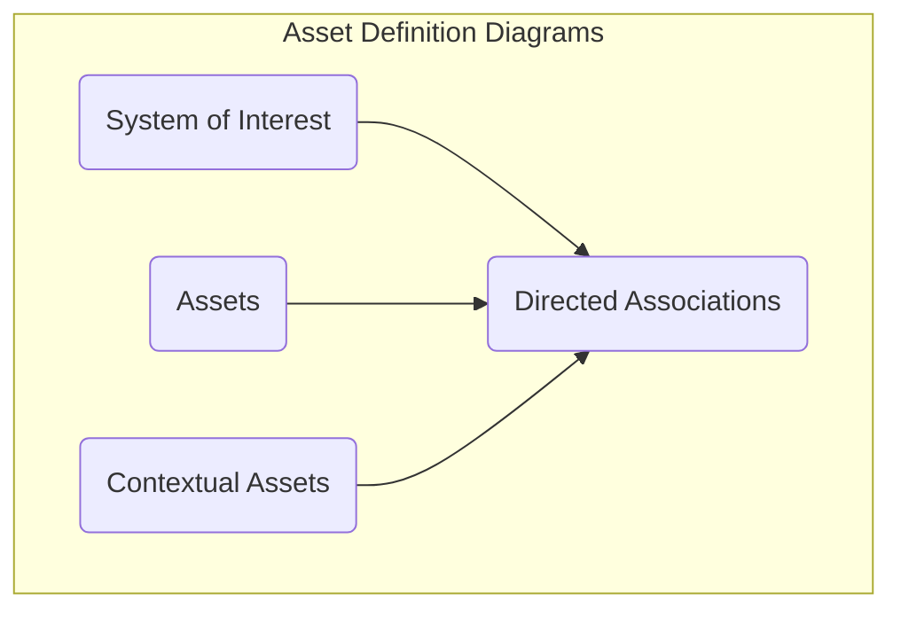
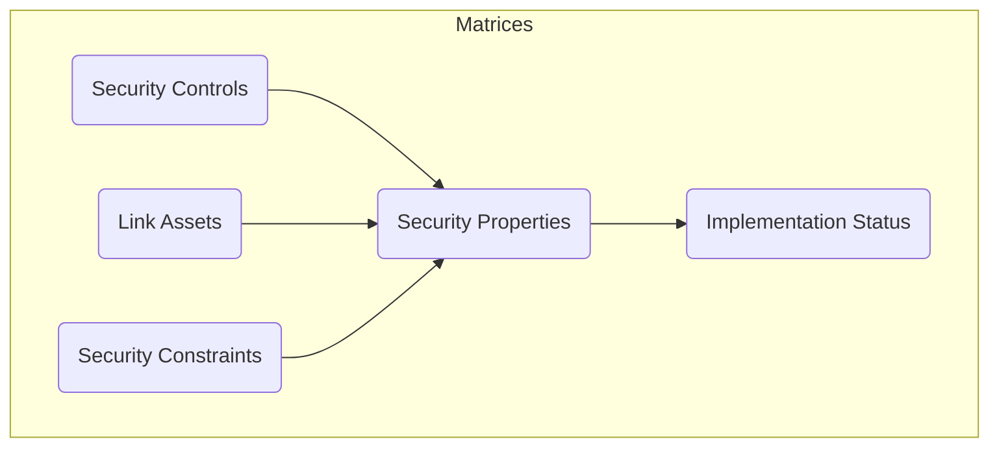

# Threat Mitigation

The threat mitigation stage involves the use of Asset Definition Diagrams and Dependency Matrices to tie the threat paths generated during the threat modelling stage to the Assets within the system and potential security mitigations. The purpose of this activity is to provide traceability between system components, security controls and malicious actions. 

## Overview

The threat mitigation process requires the allocation of system components and threat mitigations to the threat model developed in the [Threat Modelling](./threat-modelling.md) process. This allows the modeller to describe potential mitigations against the previously identified threat paths, allocate those mitigations to specific system assets and document the implementation state of those mitigations. 

> **Note**: The information contained in this documentation set aims to guide a modeller and provide instructions on how to use the CEMT to produce the necessary views in CAMEO Systems Modeler. The production of an accurate and comprehensive model with appropriate mitigations depends on the cybersecurity expertise and the system knowledge of the modelling team; this documentation simply outlines how to use the CEMT, not how to produce a comprehensive assessment.

## Asset Definition Diagrams

Asset Definition Diagrams provide the ability for the modeller to define a System Breakdown Structure for the system of interest. This creates objects that represent the assets and components within the system and the system context to which security mitigations can be allocated. 

Asset Definition Diagrams are drawn using a `CEMT Asset Definition Diagram`, which can be created by right clicking on a `Package` in the containment tree, selecting `Create Diagram` from the context menu and then selecting `CEMT Asset Definition Diagram`.

> **Note**: The `CEMT Asset Definition Diagram` is a [Custom Diagram](../README.md#custom-diagrams). You can also create an Asset Definition Diagram using a standard `SysML Block Definition Diagram` and manually apply the stereotypes if you wish. If the system of interest is being developed using MBSE techniques and the CEMT process is being integrated into an existing model you may already have a defined system breakdown structure in the form of a `SysML Block Definition Diagram`. If so you can apply the `System` and `Asset` stereotypes to the existing `Blocks` if you wish, rather than creating new objects and a new hierarchy.

<mark>creation video</mark>

https://user-images.githubusercontent.com/7237737/180377140-f613ddba-a722-4db6-a1e5-df7a7e03c937.mp4

Asset Definition Diagrams use the following CEMT stereotypes:

 - [`Asset`](./stereotypes.md#asset)
 - [`System`](./stereotypes.md#system)
 - [`DirectedAssociation`](./stereotypes.md#directedassociation)

### System of Interest

https://user-images.githubusercontent.com/7237737/180377207-68d1d84a-75a0-4ad4-802e-9b629b8ca3ab.mp4

### Assets

https://user-images.githubusercontent.com/7237737/180377237-56bf5555-aafc-4415-b91c-97b582edbe58.mp4

### Contextual Assets

https://user-images.githubusercontent.com/7237737/180377260-030fb82e-873d-4c7a-92ef-69a2de420750.mp4

### Directed Associations

https://user-images.githubusercontent.com/7237737/180377285-0e9664b4-9b3a-4842-857e-d1b60d2a4aef.mp4

## Matrices

 > [Return to Modelling Process Flowchart](/README.md#threat-mitigation)
