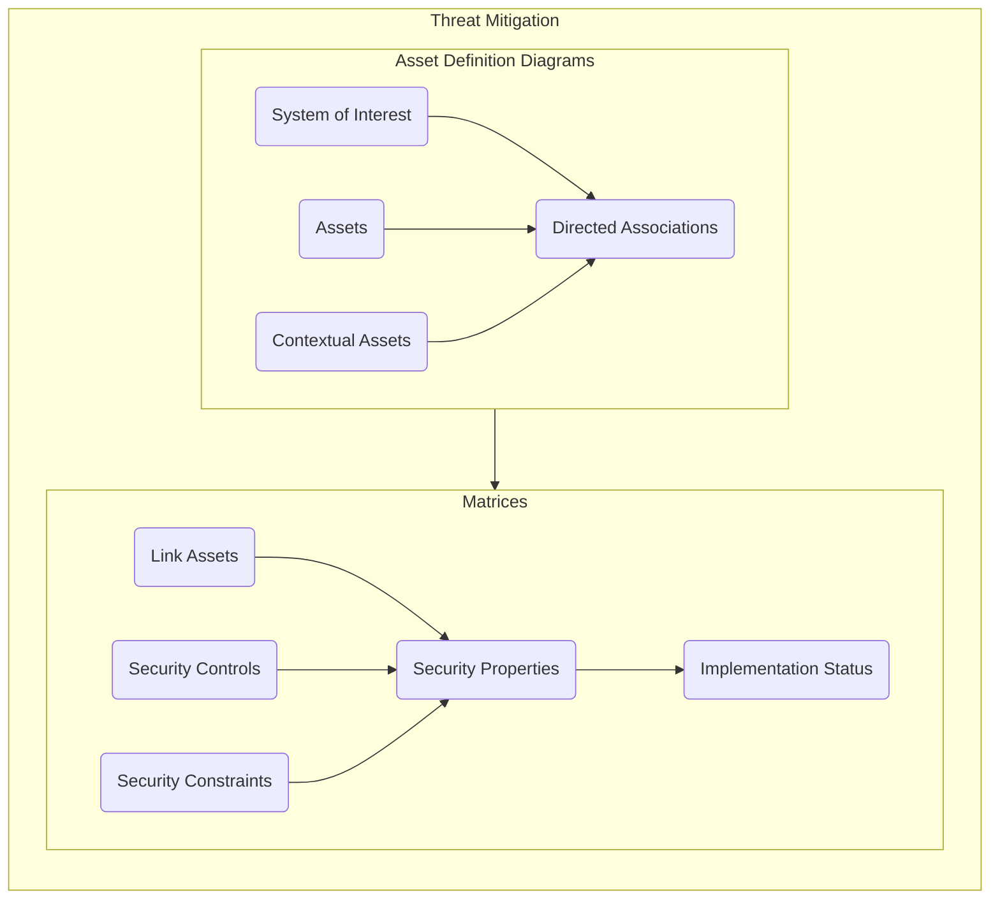
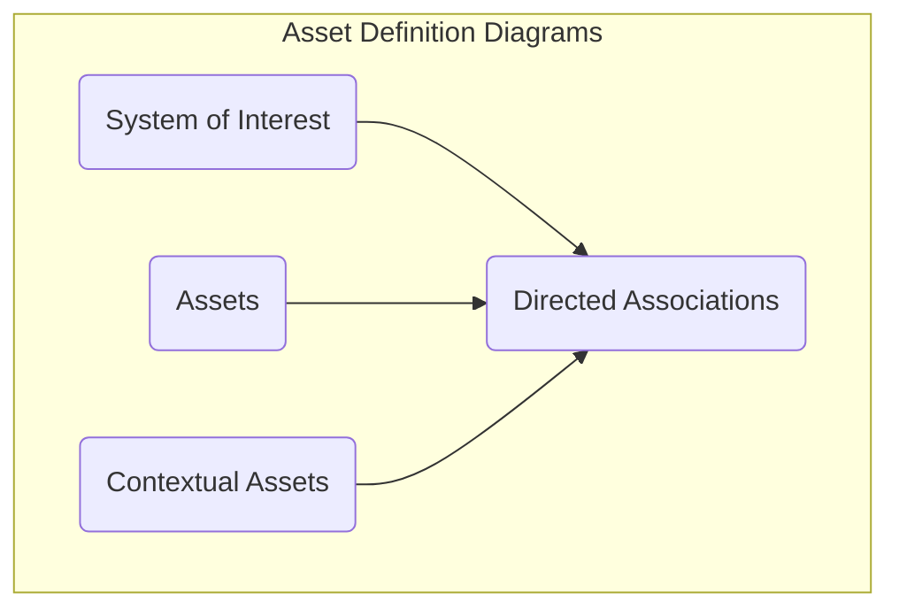
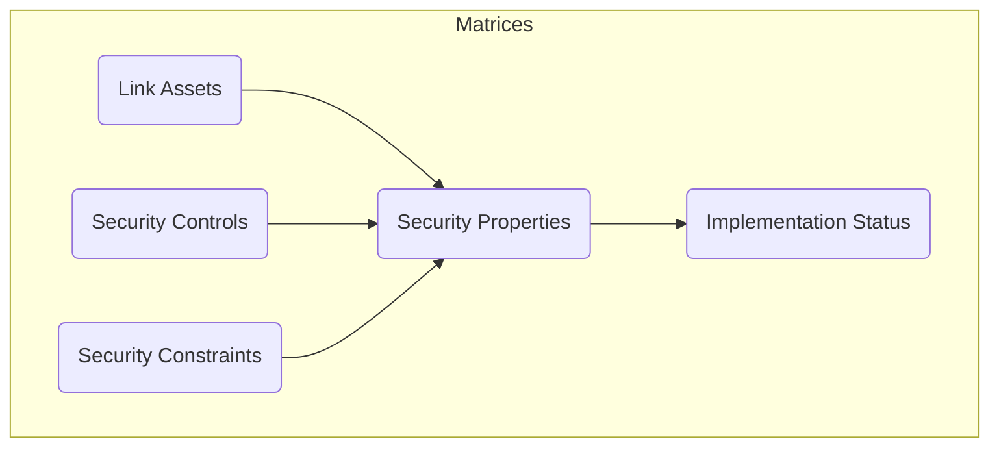

# Threat Mitigation

The threat mitigation stage involves the use of Asset Definition Diagrams and Dependency Matrices to tie the threat paths generated during the threat modelling stage to the Assets within the system and potential security mitigations. The purpose of this activity is to provide traceability between system components, security controls and malicious actions. 

## Overview

The threat mitigation process requires the allocation of system components and threat mitigations to the threat model developed in the [Threat Modelling](./threat-modelling.md) process. This allows the modeller to describe potential mitigations against the previously identified threat paths, allocate those mitigations to specific system assets and document the implementation state of those mitigations. 

> **Note**: The information contained in this documentation set aims to guide a modeller and provide instructions on how to use the CEMT to produce the necessary views in CAMEO Systems Modeler. The production of an accurate and comprehensive model with appropriate mitigations depends on the cybersecurity expertise and the system knowledge of the modelling team; this documentation simply outlines how to use the CEMT, not how to produce a comprehensive risk assessment.

## Asset Definition Diagrams

Asset Definition Diagrams provide the ability for the modeller to define a System Breakdown Structure for the system of interest. This creates objects that represent the assets and components within the system and the system context to which security mitigations can be allocated. 

Asset Definition Diagrams are drawn using a `CEMT Asset Definition Diagram`, which can be created by right clicking on a `Package` in the containment tree, selecting `Create Diagram` from the context menu and then selecting `CEMT Asset Definition Diagram`.

> **Note**: The `CEMT Asset Definition Diagram` is a [Custom Diagram](../README.md#custom-diagrams). You can also create an Asset Definition Diagram using a standard `SysML Block Definition Diagram` and manually apply the stereotypes if you wish. If the system of interest is being developed using MBSE techniques and the CEMT process is being integrated into an existing model you may already have a defined system breakdown structure in the form of a `SysML Block Definition Diagram`. If so you can apply the `System` and `Asset` stereotypes to the existing `Block`s if you wish, rather than creating new objects and a new hierarchy.

https://user-images.githubusercontent.com/7237737/180377140-f613ddba-a722-4db6-a1e5-df7a7e03c937.mp4

Asset Definition Diagrams use the following CEMT stereotypes:

 - [`Asset`](./stereotypes.md#asset)
    - [`System`](./stereotypes.md#system)
 - [`DirectedAssociation`](./stereotypes.md#directedassociation)

### System of Interest

The first step in developing the Asset Definition Diagram is to insert a [`System`](./stereotypes.md#system) object that represents the system that is being evaluated using the CEMT. This is done by selecting `System of Interest` from the drawing palette and placing it on the diagram.

https://user-images.githubusercontent.com/7237737/180377207-68d1d84a-75a0-4ad4-802e-9b629b8ca3ab.mp4

### Assets

The next step involves creating [`Asset`](./stereotypes.md#asset)s that represent the subsystems and components within the system of interest. This is done by selecting `Asset` from the drawing palette and placing them on the diagram.

https://user-images.githubusercontent.com/7237737/180377237-56bf5555-aafc-4415-b91c-97b582edbe58.mp4

### Contextual Assets

The next step requires the modeller to define the contextual assets, which are those assets that are external to the system of interest but play a role in the security of the system because they might implement security mitigations on which the system of interest depends. This is done by selecting `Contextual Asset` from the drawing palette and placing them on the diagram.

https://user-images.githubusercontent.com/7237737/180377260-030fb82e-873d-4c7a-92ef-69a2de420750.mp4

> **Note**: The `Contextual Asset` is not its own stereotype. The contextual assets are still given the [`Asset`](./stereotypes.md#asset) stereotype, but they also have the `isAbstract` property set to `true`. This is indicated on the `CEMT Asset Definition Diagram` by the name of the `Asset` being displayed in *italics*.

### Directed Associations

The final step in developing the Asset Definition Diagram is to link the system of interest, the assets and the contextual assets together into a hierarchy using [`DirectedAssociation`](./stereotypes.md#directedassociation)s. These are created by selecting `Directed Association` from the drawing palette and drawing them between the objects, starting from the parent and going down to the child.

https://user-images.githubusercontent.com/7237737/180377285-0e9664b4-9b3a-4842-857e-d1b60d2a4aef.mp4

### Additional Optional Steps

The `CEMT Asset Definition Diagram` also shows the controls that are applicable to the `Asset` and their implementation state, once the Threat Mitigation process has been completed. While this information will not be populated onto the model until the steps outlined in the [Matrices](#matrices) section have been completed, it provides a view that can be useful for reviewers once the model has been fully populated. An example of this is shown in the sample diagram below.

## Matrices

Matrices provide the ability for the modeller to rapidly create relationships between the various objects in the model. This step  involves the creation of objects that represent potential mitigation techniques and the linking of those to both the threat model and the assets within the system that have been defined in previous steps. 

The matrices are created using the `Dependency Matrix` diagram that is built into CAMEO Systems Modeler. These are pre-defined as part of the CEMT, and are copied across from the `Cyber Profile` as shown below:

https://user-images.githubusercontent.com/7237737/177059450-a97e0c5d-5020-4f10-9a62-4c394498e6b6.mp4

The matrices are contained in the `Matrices` package, and include:

 - Asset-Action: Allows for the mapping of `Asset`s to `ThreatAction`s and `DetectionAction`s;
 - Constraint-Asset: Allows for the mapping of `SecurityConstraint`s to `Asset`s; and
 - Control-Action: Allows for the mapping of `SecurityControl`s to `ThreatAction`s and `DetectionAction`s.

Matrices use the following CEMT stereotypes:

 - [`SecurityControl`](./stereotypes.md#securitycontrol)
    - [`NoneControl`](./stereotypes.md#nonecontrol)
    - [`SecurityConstraint`](./stereotypes.md#securityconstraint)
        - [`ISMControl`](./stereotypes.md#ismcontrol)
 - [`Asset`](./stereotypes.md#asset)
    - [`NoneAsset`](./stereotypes.md#noneasset)
 - [`Mitigates`](./stereotypes.md#mitigates)
 - [`Affects`](./stereotypes.md#affects)
 - [`SecurityProperty](./stereotypes.md#securityproperty)

### Link Assets

The first step in this process involves linking of the `Asset`s created in the `Asset Definition Diagram` to the `ThreatAction`s and `DetectionAction`s created in the [Threat Modelling](./threat-modelling.md) phase. This is achieved using the `Asset-Action` matrix which provides a table of with all of the `Asset`s in the model on one axis and all of the `ThreatAction`s and `DetectionAction`s in the model on the other axis. Double-clicking on the cell at the junction between a particular `Asset` and `ThreatAction` or `DetectionAction` will create an [`Affects`](./stereotypes.md#affects) relationship between those two objects.

Once this relationship has been created, the `Mal-Activity Diagrams` will be updated to list the affected `Asset` on the `ThreatAction` and/or `DetectionAction`.

https://user-images.githubusercontent.com/7237737/187433155-08b4f9a0-f8e7-4925-8493-db2cb5abef39.mp4

### Security Controls

The second step in the process is to create [`SecurityControl`](./stereotypes.md#securitycontrol)s that could potentially mitigate the threats outlined in the threat model and link those controls to the relevant nodes of the threat model. These controls may be created from first principles for your specific model - ie. the modeller reviews each node in the threat model and proposes specific controls that would mitigate that step - or they could be imported from an existing library of controls, similar to the [ISM profile example](../ISM/README.md).

Once these controls have been created or imported, they will appear in the `Control-Action` matrix, and they can be linked to the `ThreatAction`s or `DetectionAction`s of the threat model in the same manner the `Asset`s were linked. Double-clicking on the cell at the junction between a particular `SecurityControl` and `ThreatAction` or `DetectionAction` will create a [`Mitigates`](./stereotypes.md#mitigates) relationship between those two objects.

In some cases, there may not be a feasible mitigating control for a partiuclar node in the threat model. In this case, a `SecurityControl` with the [`NoneControl`](./stereotypes.md#nonecontrol) stereotype should be created. This `NoneControl` can then be linked to those threat model nodes that do not have any feasible mitigating controls, allowing the modeller and reviewers to differentiate between those threat model nodes that have been assessed to not have any potential controls from those that have not yet been assessed.

Once the `SecurityControl`s have been created, the `Control Description` field should be set. This description should provide a summary description of the control to explain to reviewers what the control is and what it does. This field can also be set for each control using the `Control List` Summary Diagram.

https://user-images.githubusercontent.com/7237737/187433193-682f571b-4893-4012-b03b-77bccc10ee50.mp4

https://user-images.githubusercontent.com/7237737/187433200-e9e91792-bb8e-474d-89d7-59f8c077ad19.mp4

> **Note**: It is important to note that the purpose of this step is to propose all controls that could feasibly be implemented into the system to mitigate a particular step of the threat path. The modeller should propose and link all of these potential controls, rather than only selecting and documenting those controls that they intend to implement. The purpose of this activity is to demonstrate to decision makers not only what has been done to mitigate a particular threat, but also what further steps could be taken to further mitigate the threat. The act of creating and linking a control is not meant to imply that the control will be implemented, or even that the control *should* be implemented, it is simply to show that it could be implemented. In this context, a non-implemented control is not a non-compliance or a shortcoming that needs addressing, it is simply a acknowledgement that a risk decision has been made to not implement that potential control.

### Security Constraints

This is an **optional** step in the process, that acknowledges the reality of the situation that most systems will have mandated security controls, that come in the form of either specific system requirements or compliance frameworks. As these generic controls have not been derived specifically from the system's threat model, there is a likelihood that these mandated controls may not be able to be linked into the threat model like the `SecurityControl`s described in the previous step. [`SecurityConstraint`](./stereotypes.md#securityconstraint)s are a specific type of `SecurityControl` that can also be linked directly to an `Asset`, as well as being able to be linked to the threat model. The [ISM profile example](../ISM/README.md) actually uses `SecurityConstraint`s as there are a number of generic controls in that control framework (such as governance, management and documentation controls) that do not lend themselves to being tied to specific nodes of a threat model.

Once `SecurityControl`s have been created or imported, they will appear in the `Constraint-Asset` matrix, from where they can be linked to the `Asset`s in the model. Double-clicking on the cell at the junction between a particular `SecurityConstraint` and `Asset` will create an [`Applies`](./stereotypes.md#applies) relationship between those two objects.

To track `SecurityConstraint`s that are not relevant to the system, they should be linked to an `Asset` that is stereotyped as a [`NoneAsset`](./stereotypes.md#noneasset), which can track the fact that the constraint has been assessed, but has been found to be not applicable to the system.

Once the `SecurityConstraint`s have been created, the `Control Description` field should be set. This description should provide a summary description of the control to explain to reviewers what the control is and what it does. This field can also be set for each control using the `Constraint List` Summary Diagram.

https://user-images.githubusercontent.com/7237737/187433243-fc00a9d1-64cb-458a-833f-a3a5e9713e20.mp4

https://user-images.githubusercontent.com/7237737/187433274-8d48c090-a34b-462d-8495-8499142919c2.mp4

> **Note**: The use of `SecurityConstraint`s should be minimised, as it conflicts with the intention of having a set of mitigating controls that are inherently scoped to the system's context. The prevelance of compliance frameworks with security engineering, however, necessitates that the CEMT can handle these overarching mandated security mitigations which is why `SecurityConstraint`s are included. As `SecurityConstraint`s inherit from `SecurityControl`s, they can still be linked to the threat model and every effort should be made to link them to the threat model, with direct links to the `Asset`s used only when absolutely necessary.

### Security Properties

Once all of the `Asset`s, `SecurityControl`s and `SecurityConstraint`s have been linked, `SecurityProperty`s can be created. `SecurityProperty`s are an instantiation of the `SecurityControl` or `SecurityConstraint` onto a particular `Asset`, and carry the implementation status of the particular security mitigation on that specific asset. 

While these `SecurityProperty`s could be created manually as a property on each `Asset`, the [Controls macro](../Macros/README.md#controls) will automatically create the necessary `SecurityProperty`s based on the relationships that were created when the assets, threat nodes and mitigations were linked together using the various matrices.

https://user-images.githubusercontent.com/7237737/187433301-1361e647-6aad-4aa5-a73c-eadf65edabcf.mp4

### Implementation Status

The final step in the threat mitigation phase involves the determination and documentation of the `Implementation` status of each `SecurityProperty`. Once the `Implementation` status has been set, the `Implementation Detail` field should be set. This should provide a summary of how the `SecurityProperty` was implemented to provide additional detail as to the level and method of implementation. This field can also be set for each property using the `Property List` Summary Diagram.

https://user-images.githubusercontent.com/7237737/187433326-a972a6c6-97af-4ebf-83e7-502b80430b9f.mp4

> **Note**: When the `Property List` table becomes large due to a significant number of `SecurityProperty`s it can become more efficient to export the table to Microsoft Excel, enter the Implementation status and Implementation Detail in the spreadsheet and then import that data back into the model. This can help with bulk updates, and with getting system SMEs that do not have access to the CAMEO tool to assist with the determination of the Implementation status. This is a built-in feature of CAMEO System Modeler - instructions for how to conduct this export/import/sync can be found on the [NoMagic website](https://docs.nomagic.com/display/MD190/Sync+with+Excel+or+CSV+files).

 > [Return to Modelling Process Flowchart](/README.md#threat-mitigation)
