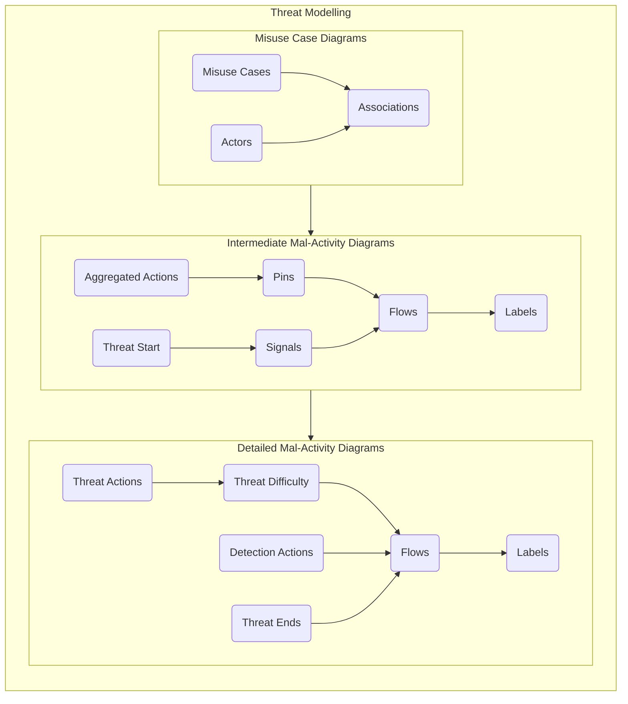
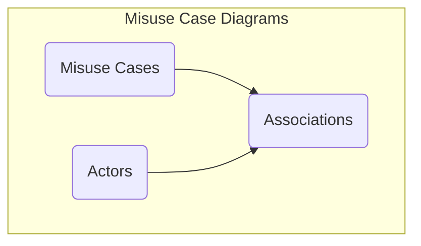
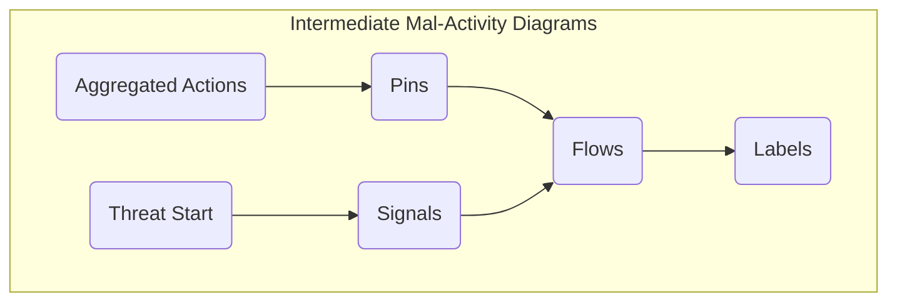
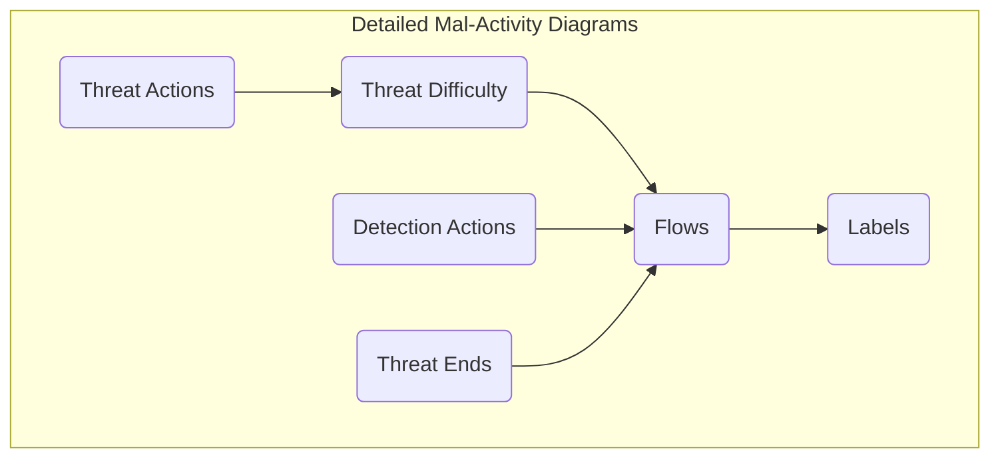

# Threat Modelling

The threat modelling stage involves the use of Misuse Case Diagrams and Mal-Activity Diagrams to model the way threat actors interact with the attack surface to achieve their malicious intent. The purpose of this activity is to enumerate the paths that an attacker must take to compromise the system.

## Overview

The threat modelling process involves the investigation of misuse cases which represent the top level threats to a systems and the development of a nested flow chart, in the form of hierarchical mal-activity diagrams, that articulates what steps an attacker needs to perform in order to achieve those misuse cases. The information contained in this document aims to guide a modeller and provide instructions on how to use the CEMT to produce the necessary views in CAMEO Systems Modeler. The production of an accurate and comprehensive model depends on the cybersecurity expertise and the system knowledge of the modelling team; this documentation simply outlines how to use the CEMT, not how to produce a comprehensive assessment.

## Misuse Case Diagrams

 > [Return to Modelling Process Flowchart](/README.md#threat-modelling)

## Intermediate Mal-Activity Diagrams

 > [Return to Modelling Process Flowchart](/README.md#threat-modelling)

## Detailed Mal-Activity Diagrams

 > [Return to Modelling Process Flowchart](/README.md#threat-modelling)