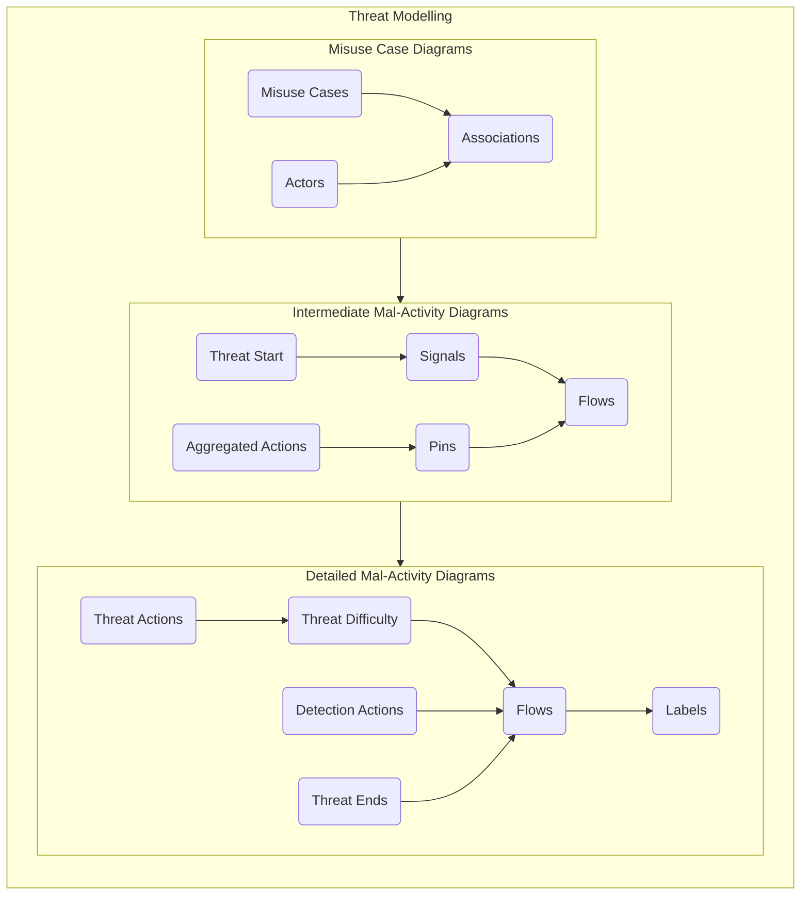
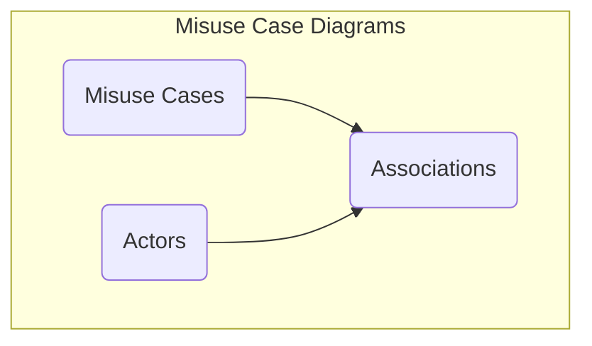
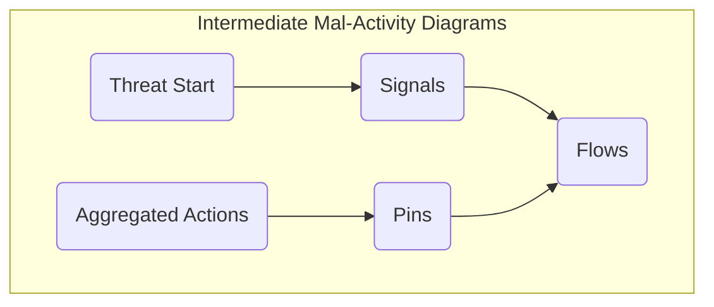
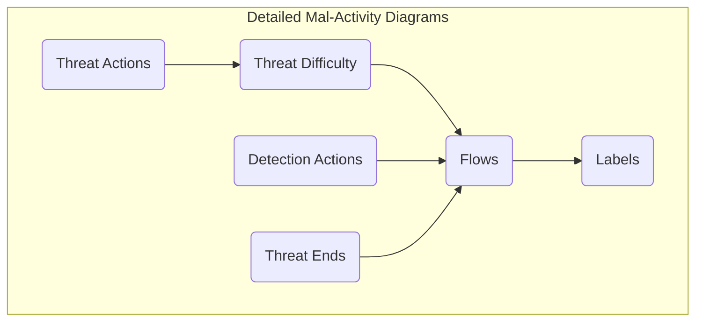

# Threat Modelling

The threat modelling stage involves the use of Misuse Case Diagrams and Mal-Activity Diagrams to model the way threat actors interact with the attack surface to achieve their malicious intent. The purpose of this activity is to enumerate the paths that an attacker must take to compromise the system.

## Overview

The threat modelling process involves the investigation of misuse cases which represent the top level threats to a systems and the development of a nested flow chart, in the form of hierarchical mal-activity diagrams, that articulates what steps an attacker needs to perform in order to achieve those misuse cases. The information contained in this document aims to guide a modeller and provide instructions on how to use the CEMT to produce the necessary views in CAMEO Systems Modeler. The production of an accurate and comprehensive model depends on the cybersecurity expertise and the system knowledge of the modelling team; this documentation simply outlines how to use the CEMT, not how to produce a comprehensive assessment.

## Misuse Case Diagrams

The process for creating Misuse Case Diagrams requires the modeller to define misuse cases that align with the top level threats to the system, articulate the actors that perform those misuse cases and then link them together using associations.

Misuse Case Diagrams are drawn using the `CEMT Misuse Case Diagram`, which can be created inside a `Package` in the containment tree.

> **Note**: The `CEMT Misuse Case Diagram` is a [Custom Diagram](../README.md#custom-diagrams). You can also create a Misuse Case Diagram using a standard `SysML Use Case Diagram` and manually apply the stereotypes if you wish.

Misuse Case Diagrams use the following CEMT stereotypes:

 - [`MisuseCase`](./stereotypes.md#misusecase)
 - [`CyberActor`](./stereotypes.md#cyberactor)
   - [`MaliciousActor`](./stereotypes.md#maliciousactor)
   - [`NonMaliciousActor`](./stereotypes.md#nonmaliciousactor)
 - [`Association`](./stereotypes.md#association)

### Misuse Cases, Actors and Associations

The diagrams are created by placing [`MaliciousActors`](./stereotypes.md#maliciousactor), [`NonMaliciousActors`](./stereotypes.md#nonmaliciousactor) and [`MisuseCases`](./stereotypes.md#misusecase), naming them appropriately and then connecting them together using the Association relationship. The CEMT also includes a `Mis-use Case` legend, which will apply the appropriate colouring and adornments. This is shown in the video snippet below.

https://user-images.githubusercontent.com/7237737/177487459-e7660d65-c24c-4d7c-ab7b-ba983d8c70a6.mp4

### Additional Steps

Additional `MaliciousActors`, `NonMaliciousActors` and `MisuseCases` can be drawn on the same misuse case diagram until a full picture of the top level threats to the system has been created.

The purpose of these diagrams is to provide a high level view of the scope of the assessment, in terms of the actors and the threats that they pose to the system. Modellers should ensure that a misuse case has been created for each of the top level threats to the sys

 > [Return to Modelling Process Flowchart](/README.md#threat-modelling)

## Intermediate Mal-Activity Diagrams

The process for creating Intermediate Mal-Activity Diagrams requires the modeller to develop a detailed flow chart of the steps an attacker needs to take to achieve a particular misuse case. They provide the nested detail below the misuse case diagram, and articulate the path that the threat takes through the system as well as the ways in which a system can detect and mitigate the threat.

Intermediate Mal-Activity Diagrams are drawn using the `CEMT Mal-Activity Diagram`, which can be created by right clicking on a MisuseCase, selecting `Create Diagram` from the context menu and then selecting `CEMT Mal-Activity Diagram`. Creating a `CEMT Mal-Activity Diagram` does not automatically apply the [`MalActivity`](./stereotypes.md#malactivity) stereotype to the Activity object that is created. A constraint on the [`MisuseCase`](./stereotypes.md#misusecase) stereotype checks for this in real-time if CAMEO active validation is turned on, and indicates that you can either manually apply the stereotype - by right-clicking on the Activity object that was created and selecting `MalActivity` from the context menu, or by running the included [Misuse macro](../Macros/README.md#misuse), as shown in the video below.

> **Note**: The `CEMT Mal-Activity Diagram` is a [Custom Diagram](../README.md#custom-diagrams). You can also create a Intermediate Mal-Activity Diagram using a standard `SysML Activity Diagram` and manually apply the stereotypes if you wish.

https://user-images.githubusercontent.com/7237737/179884484-dc7cdcd6-3d92-406a-83b6-28a08240c6c7.mp4

Intermediate Mal-Activity Diagrams use the following CEMT stereotypes:

 - [`ThreatStart`](./stereotypes.md#threatstart)
 - [`AggregatedAction`](./stereotypes.md#aggregatedaction)
 - [`ThreatInput`](./stereotypes.md#threatinput)
 - [`ThreatOutput`](./stereotypes.md#threatoutput)
 - [`ThreatModelFlow`](./stereotypes.md#threatmodelflow)
   - [`ThreatFlow`](./stereotypes.md#threatflow)
   - [`DetectionFlow`](./stereotypes.md#detectionaction)
 - [`Signal`](./stereotypes.md#signals)
   - [`ThreatImpactSignal`](./stereotypes.md#threatimpactsignal)
   - [`ThreatDetectionSignal`](./stereotypes.md#threatdetectionsignal)
 - [`ThreatSendSignal`](./stereotypes.md#threatsendsignal)
 - [`ThreatAcceptEvent`](./stereotypes.md#threatacceptevent)
 - [`ThreatImpact`](./stereotypes.md#threatimpact)
 - [`ThreatDetection`](./stereotypes.md#threatdetection)

### Threat Start

The first step in developing the Intermediate Mal-Activity Diagrams is to insert a [`ThreatStart`](./stereotypes.md#threatstart) object into the drawing and name it to match the misuse case.

https://user-images.githubusercontent.com/7237737/179894577-9b2b8317-d76f-4272-b0c7-009776ded925.mp4

### Signals

Signals should be created next that capture the expected outcomes of the misuse case. The [`ThreatImpactSignal`](./stereotypes.md#threatimpactsignal) stereotype should be used for the undesirable outcomes which the threat actor is trying to achieve. While these can be expressed using the Confidentiality, Integrity and Availability triad, they do not have to be expressed like this. The [`ThreatDetectionSignal`](./stereotypes.md#threatdetectionsignal) stereotype should be used to create the detection outcomes which represent the system detecting the threat actor.

https://user-images.githubusercontent.com/7237737/179894602-a06bb366-dccd-4b64-b699-6d282032b7d4.mp4

These are drawn on the `CEMT Mal-Activity Diagram` by placing a [`ThreatImpact`](./stereotypes.md#threatimpact) object for the undesirable threat outcomes and a [`ThreatDetection`](./stereotypes.md#threatdetection) object for the detection outcomes. The `ThreatImpactSignals` and `ThreatDetectionSignals` can then be dragged from the containment tree onto the `ThreatImpacts` and `ThreatDetections`.

https://user-images.githubusercontent.com/7237737/179894631-5e16f41e-77cd-48c8-ab3e-415a7e39c97f.mp4

> **Note**: If you add the signals to the `ThreatImpactSignal` or `ThreatDetectionSignal` via the context menu that appears when you place the `ThreatImpact` or `ThreatDetection` object, rather than by dragging them from the containment tree, the underlying `ThreatImpact` or `ThreatDetection` stereotypes are stripped from the object. If you attach the signal in this way, you may need to re-apply these stereotypes manually. You will notice this because the red and blue colours from the legend will not apply properly, and the stereotype can be re-applied by right clicking on the object and selecting `ThreatImpact` or `ThreatDetection` from the context menu.

### Aggregated Actions

https://user-images.githubusercontent.com/7237737/179895990-d646c9e8-21ec-4400-8c0d-408636918cf2.mp4

### Pins

https://user-images.githubusercontent.com/7237737/179895999-0bed82a1-8370-4173-af7c-3371656b298e.mp4

### Flows

https://user-images.githubusercontent.com/7237737/179896018-0a9a8697-a03b-4ad0-a180-3a0faba7e495.mp4

### Additional Steps

Send + Accept

Multiple nested levels

 > [Return to Modelling Process Flowchart](/README.md#threat-modelling)

## Detailed Mal-Activity Diagrams

 > [Return to Modelling Process Flowchart](/README.md#threat-modelling)
