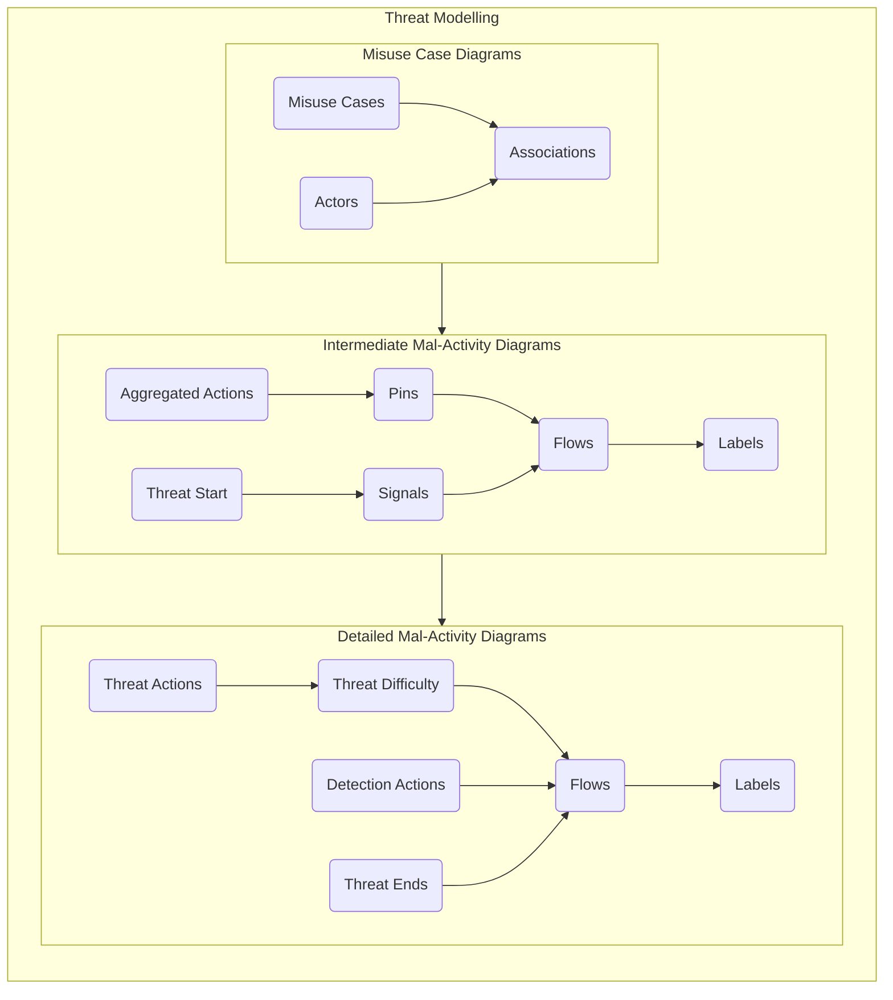
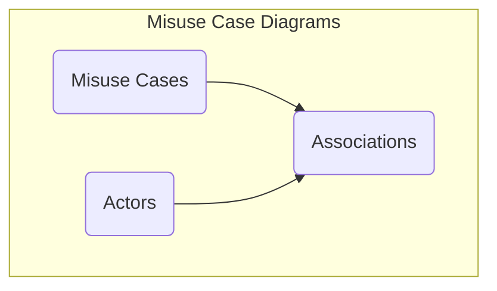

# Threat Modelling

The threat modelling stage involves the use of Misuse Case Diagrams and Mal-Activity Diagrams to model the way threat actors interact with the attack surface to achieve their malicious intent. The purpose of this activity is to enumerate the paths that an attacker must take to compromise the system.

## Overview

## Misuse Case Diagrams

## Intermediate Mal-Activity Diagrams

## Detailed Mal-Activity Diagrams

 > [Return to Modelling Process Flowchart](/README.md#threat-modelling)