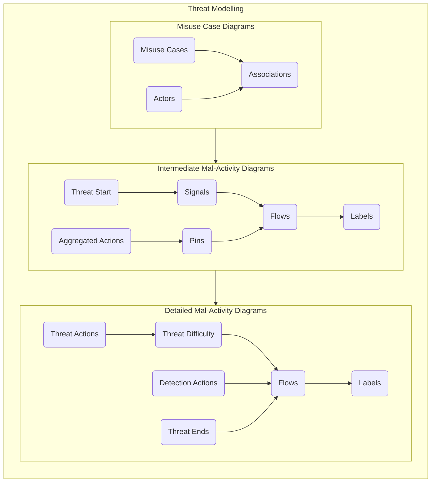
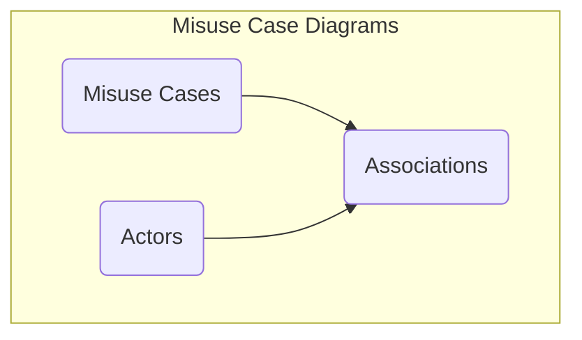
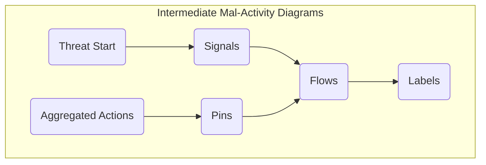
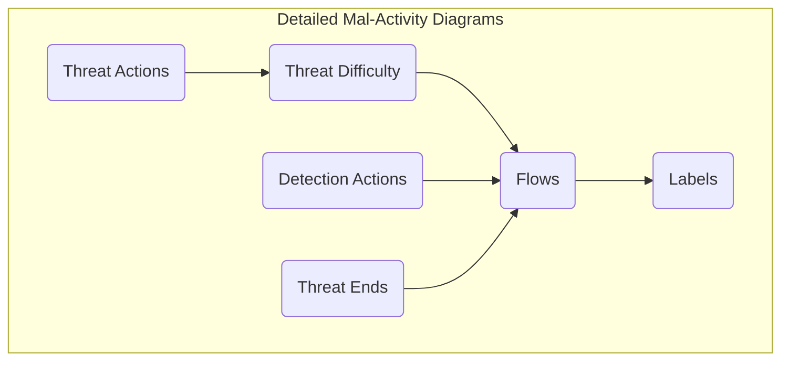

# Threat Modelling

The threat modelling stage involves the use of Misuse Case Diagrams and Mal-Activity Diagrams to model the way threat actors interact with the attack surface to achieve their malicious intent. The purpose of this activity is to enumerate the paths that an attacker must take to compromise the system.

## Overview

The threat modelling process involves the investigation of misuse cases which represent the top level threats to a systems and the development of a nested flow chart, in the form of hierarchical mal-activity diagrams, that articulates what steps an attacker needs to perform in order to achieve those misuse cases. The information contained in this document aims to guide a modeller and provide instructions on how to use the CEMT to produce the necessary views in CAMEO Systems Modeler. The production of an accurate and comprehensive model depends on the cybersecurity expertise and the system knowledge of the modelling team; this documentation simply outlines how to use the CEMT, not how to produce a comprehensive assessment.

## Misuse Case Diagrams

The process for creating Misuse Case Diagrams requires the modeller to define misuse cases that align with the top level threats to the system, articulate the actors that perform those misuse cases and then link them together using associations.

Misuse Case Diagrams are drawn using the `CEMT Misuse Case Diagram`, which can be created inside a `Package` in the containment tree.

> **Note**: The `CEMT Misuse Case Diagram` is a [Custom Diagram](../README.md#custom-diagrams). You can also create a Misuse Case Diagram using a standard `SysML Use Case Diagram` and manually apply the stereotypes if you wish.

Misuse Case Diagrams use the following CEMT stereotypes:

 - [MisuseCase](./stereotypes.md#misusecase)
 - [CyberActor](./stereotypes.md#cyberactor)
   - [MaliciousActor](./stereotypes.md#maliciousactor)
   - [NonMaliciousActor](./stereotypes.md#nonmaliciousactor)
 - [Association](./stereotypes.md#association)

The diagrams are created by placing [MaliciousActors](./stereotypes.md#maliciousactor), [NonMaliciousActors](./stereotypes.md#nonmaliciousactor) and [MisuseCases](./stereotypes.md#misusecase), naming them appropriately and then connecting them together using the Association relationship. The CEMT also includes a `Mis-use Case` legend, which will apply the appropriate colouring and adornments. This is shown in the video snippet below.

https://user-images.githubusercontent.com/7237737/177487459-e7660d65-c24c-4d7c-ab7b-ba983d8c70a6.mp4

Additional [MaliciousActors](./stereotypes.md#maliciousactor), [NonMaliciousActors](./stereotypes.md#nonmaliciousactor) and [MisuseCases](./stereotypes.md#misusecase) can be drawn on the same misuse case diagram until a full picture of the top level threats to the system has been created.

The purpose of these diagrams is to provide a high level view of the scope of the assessment, in terms of the actors and the threats that they pose to the system. Modellers should ensure that a misuse case has been created for each of the top level threats to the sys

 > [Return to Modelling Process Flowchart](/README.md#threat-modelling)

## Intermediate Mal-Activity Diagrams

The process for creating Intermediate Mal-Activity Diagrams requires the modeller to develop a detailed flow chart of the steps an attacker needs to take to achieve a particular misuse case. They provide the nested detail below the misuse case diagram, and articulate the path that the threat takes through the system as well as the ways in which a system can detect and mitigate the threat.

Intermediate Mal-Activity Diagrams are drawn using the `CEMT Mal-Activity Diagram`, which can be created inside a `Package` in the containment tree.

> **Note**: The `CEMT Mal-Activity Diagram` is a [Custom Diagram](../README.md#custom-diagrams). You can also create a Intermediate Mal-Activity Diagram using a standard `SysML Activity Diagram` and manually apply the stereotypes if you wish.

Intermediate Mal-Activity Diagrams use the following CEMT stereotypes:

 - [ThreatStart](./stereotypes.md#threatstart)
 - [AggregatedAction](./stereotypes.md#aggregatedaction)
 - [ThreatInput](./stereotypes.md#threatinput)
 - [ThreatOutput](./stereotypes.md#threatoutput)
 - [ThreatModelFlow](./stereotypes.md#threatmodelflow)
   - [ThreatFlow](./stereotypes.md#threatflow)
   - [DetectionFlow](./stereotypes.md#detectionaction)
 - [ThreatSendSignal](./stereotypes.md#threatsendsignal)
 - [ThreatAcceptEvent](./stereotypes.md#threatacceptevent)
 - [ThreatImpact](./stereotypes.md#threatimpact)
 - [ThreatDetection](./stereotypes.md#threatdetection)

The diagrams are created by placing ...

https://user-images.githubusercontent.com/7237737/179883971-68c666db-56d2-4a67-a5d0-91c2e26dae8e.mp4

Start -> Impact/Detection

Actions -> Pins 

Flows -> Labels

Send + Accept

 > [Return to Modelling Process Flowchart](/README.md#threat-modelling)

## Detailed Mal-Activity Diagrams

 > [Return to Modelling Process Flowchart](/README.md#threat-modelling)
