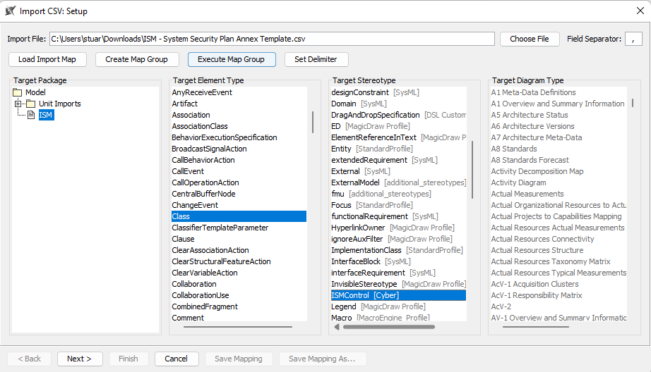
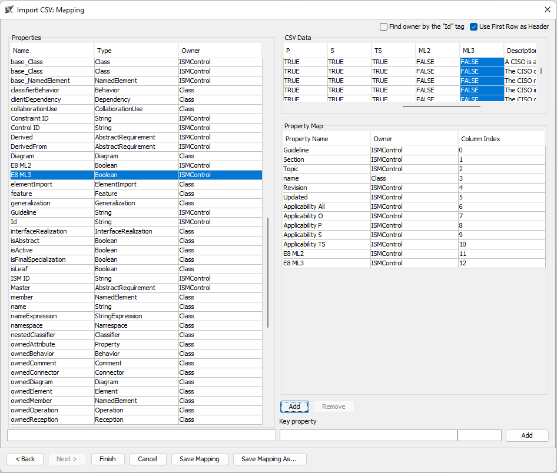

# ISM

This section provides profiles for the ACSC Information Security Manual and the ACSC Essential Eight Maturity Model.

A profile for a new ISM release can be made by:
 - Downloading the SSP Annex Excel Template [managed by ACSC](https://www.cyber.gov.au/acsc/view-all-content/ism);
 - Open the Excel file and use Excel's Find and Replace tool to replace `Yes` with `TRUE` and `No` with `FALSE` in the Applicability columns;
 - Save the Excel file as a `.csv` file;
 - Download one of the existing ISM Profiles from this repository and open it in CAMEO;
 - Delete all of the `Package`s underneath the `ISM` package, which will delete all of the `ISMControl`s, without deleting any of the diagrams or tables in the profile;
 - Select `File -> Import From -> Import CSV`, select the `.csv` file at the top and select the settings shown below:

 

 - Click `Next` and then set the mapping as shown below:

 

 - Download the [ISM_import.js](./ISM_import.js) macro from this repository and run the macro;
 - Because the CAMEO csv importer does not handle special characters, we will need to manually import the `Control Description` field, which often contains special characters;
    - Open the ISM table and synchronise it with a new Excel spreadsheet;
    - Open the synchronised Excel spreadsheet and use a `VLOOKUP` to copy the Control Description from the original SSP Annex Excel Template downloaded from ACSC;
    - Copy the list of Control Descriptions in the synchronised Excel spreadsheet and paste them back into the field as raw Values, rather than the VLOOKUP formula;
    - Save the synchronised Excel spreadsheet and then read the data back into CAMEO.
 - Remove the Excel Import legend from the table and then save the profile.

The ISM profile can be used by:
 - Import the profile to a project by selecting `Options -> Project Usages -> Use Project` and then selecting the ISM profile
 - The `ISMControl`s will not show up in the [Dependency Matrices](../Documentation/threat-mitigation.md#dependency-matrices) in the project and can be linked to `ThreatModelAction`s or directly to `Asset`s
 - `ISMControl`s that are deemed not applicable should be linked to the `NoneAsset` object that is distributed in the profile
 - The ISM tables can be copied across to your project, or used directly from the loaded profile - the relationships are saved in the project, so it will not impact other users that also import the profile