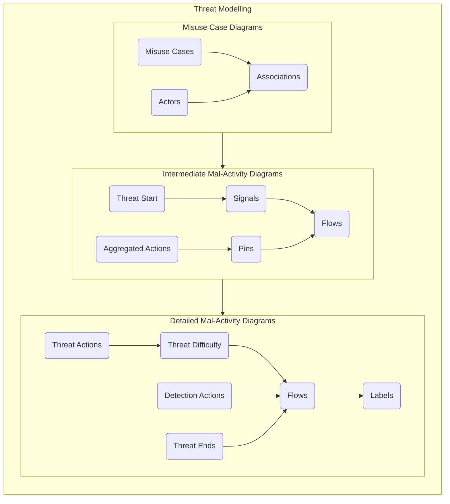
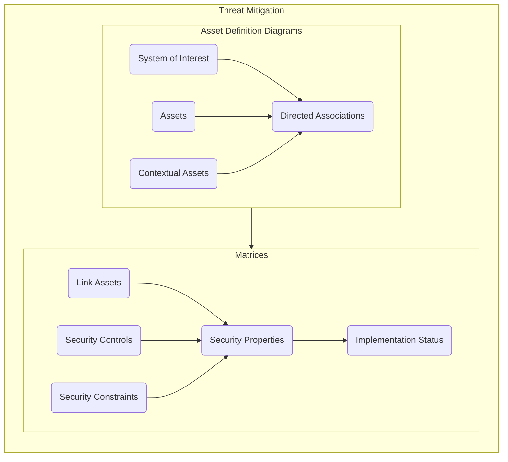
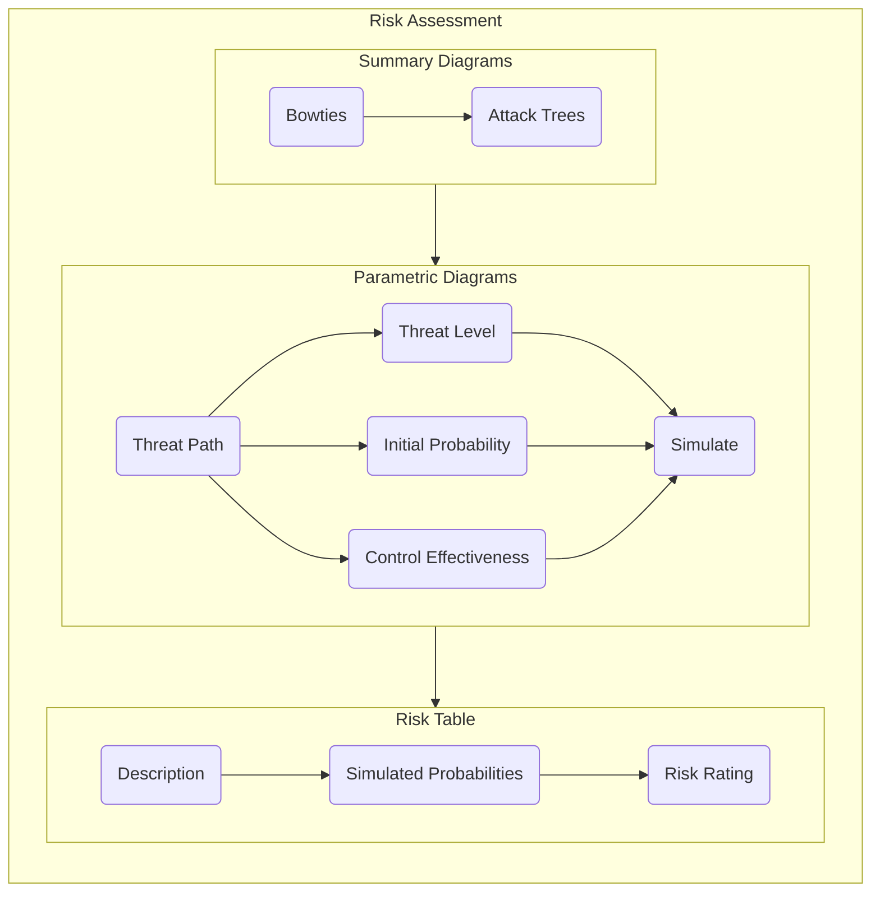

# Cyberworthiness Evaluation and Management Toolkit (CEMT)

## Background

CEMT is a tool for developing cyberworthiness assessments of complex systems. It has been created as part of a Higher Degree by Reserach (HDR) through the University of New South Wales (UNSW) Canberra to address the need for a consistent and comprehensive approach for assessing the cyberworthiness of complex systems within the Australian Government Department of Defence. 

Traditional cybersecurity assessment methodologies that leverage lists of mitigation strategies that have been compiled from historical best practice are important tools for hardening engineered systems, but their usefulness is limited when applied to bespoke systems that do not share the same operational profile or environmental context of the systems from which these best practices were derived. The CEMT provides a first-principles approach to evaluating the cyberworthiness of a system, facilitating a transparent and explainable risk assessment which is inherently scoped to the context of the system being evaluated. This delivers a comprehensive justification that can underpin a claim of cyberworthiness with the necessary level of engineering assurance.

### Cyberworthiness

Cyberworthiness is the ability for a system to continue to operate safely and effectively in a contested cyber environment. Given this explicit focus on continued operation, it has an inherent bias towards ensuring the integrity and availability of the system and its functions when faced with a cyber threat.

The inclusion of the worthiness construct is a reference to the established technical assurance frameworks that underpin concepts such as airworthiness and seaworthiness. This requires a level of rigour in the engineering analysis that provides confidence and assurance that the claim of worthiness is accurate, complete and supported by evidence. The primary guiding principles that were adopted for the development of the CEMT are based on the *Principles for Governance of Seaworthiness* from the [Defence Seaworthiness Management System Manual](https://www.defence.gov.au/sites/default/files/202-01/SeaworthinessMgmtSystemManual.pdf):

> 2.10 The seaworthiness governance principles require that seaworthiness decisions are made:
> 
> a. **mindfully** – decisions are more effective and less likely to have unintended consequences when they are made with a thorough understanding of the context, the required outcome, the options available, and their implications now and in the future
>
> b. **collaboratively** – obtaining input from all stakeholders and engaging in joint problem-solving results in better decisions (bearing in mind that collaboration does not necessarily require consensus)
> 
> c. **accountably** – decisions only become effective when people take accountability for making them happen
>
> d. **transparently** – decisions are more effective when everyone understands what has been decided and why.

CEMT approaches cyberworthiness from the perspective that the overall objective is to create a cybersecurity evaluation for mission critical and safety critical systems that are mindful of the context in which the system is operating, is intuitive enough to facilitate collaboration between all stakeholders, is understandable by key decisions makers so that they can reasonably take accountability for their decisions and is transparent in terms of how the conclusions trace to the analysis.

## Installation

### CEMT

The CEMT is distributed as an importable profile for [CAMEO Systems Modeler](https://www.3ds.com/products-services/catia/products/no-magic/cameo-systems-modeler/), which is a commercially available MBSE environment. The CEMT requires a licensed install of CAMEO Systems Modeler to function.

The simulated risk assessment portion of the CEMT also requires the [CAMEO Simulation Toolkit](https://www.3ds.com/products-services/catia/products/no-magic/cameo-simulation-toolkit/) which is a feature of CAMEO System Modeler that is included as part of the *Enterprise Edition* of CAMEO Systems Modeler - it is not included in the entry level *Architect Edition*. Without this feature installed, there may be unexpected errors in some of the CEMT functionality.

The CEMT is can be installed by copying the `Cyber_Profile.mdzip` file into the `profiles` directory of your CAMEO install directory (this defaults to `C:\Program Files\Cameo Systems Modeler\profiles\`). Once the mdzip file has been placed into the `profiles` folder, you should be able to import the model via the Options > Project Usages menu, as shown in the video below. It is recommended that you import the profile as Read-Only to prevent accidental modification of the library.

https://user-images.githubusercontent.com/7237737/174941526-18245b64-b436-40c3-be4a-6464bf09f30f.mp4

This imports all of the necessary stereotypes and attributes of the CEMT, as well as macros it relies upon. The source code for these JavaScript macros is captured in this GitHub repo, but can also be viewed inside CAMEO itself if you would like to validate it. These macros can be found at these locations:
 - [Activities.js](./Macros/Activities.js)
 - [Properties.js](./Macros/Properties.js)
 - [Controls.js](./Macros/Controls.js)
 - [Misuse.js](./Macros/Misuse.js)
 - [Risk.js](./Macros/Risk.js)

A short description of what each of these macros does can be found in the header of the macro source code.

There are also anumber of standard tables, matrices and summary diagrams that must be copied across from the Cyber profile into the model you are creating, as shown below.

https://user-images.githubusercontent.com/7237737/177059450-a97e0c5d-5020-4f10-9a62-4c394498e6b6.mp4

> **Note**: You will also need to ensure that `SimulationProfile.mdzip` is also imported into your project. This comes as part of the CAMEO Simulation Toolkit, and it should default into the same default `profiles` directory. Just follow the same process as used to import `Cyber_Profile.mdzip` but scroll down until you find `SimulationProfile.mdzip`.

### Custom Diagrams

While the CEMT supports models being created with the the standard SysML Use Case Diagrams, Activity Diagrams and Block Definition Diagrams, custom variants of these diagrams have been created with modified drawing pallettes to simplify the process of developing a cyberworthiness model. 

These diagrams can be found at these locations:
 - [CEMT Asset Definition Diagram](./Diagrams/CEMT%20Asset%20Definition%20Diagram%20descriptor.xml) - Can be used to define Asset hierarchies instead of using the standard SysML Block Definition Diagrams.
 - [CEMT Mal-Activity Diagram](./Diagrams/CEMT%20Mal-Activity%20Diagram%20descriptor.xml) - Can be used to model threat and detection flows instead of using the standard SysML Activity Diagrams.
 - [CEMT Misuse Case Diagram](./Diagrams/CEMT%20Misuse%20Case%20Diagram%20descriptor.xml) - Can be used to model misuse cases instead of using the standard SysML Use Case Diagrams.

The diagrams can be imported into your model in the following manner:

https://user-images.githubusercontent.com/7237737/177089770-5f734733-ed71-44fe-a073-71a4f998a2b1.mp4

### Information Security Manual (ISM)

While the CEMT primarily implements a first-principles threat modelling approach, rather than one built upon compliance to best-practice mitigation lists, it does also accommodate those assessments if a hybrid approach is desired by the assessor. This has initially been implemented for the Information Security Manual (ISM) that is published by the Australian Cyber Security Centre (ACSC). The `ISM_MMM-YYYY_Profile.mdzip` files contain profiles that include the entire list of ISM controls imported as a set of objects that can be incorporated into the CEMT. These can be imported into a project in the same way described above for the main CEMT package.

It is recommended that once you import the profile, you copy and paste the contents across into your model and then remove the profile. The attributes and stereotypes that are relied upon by these ISM controls are already contained within the main CEMT package, so there is no need to keep it loaded at all times. 

## Modelling Process

The high-level process to be taken through the modelling process is fairly standard. It begins with a Threat Modelling activity, then a Threat Mitigation step and finally a Risk Assessment. 

The CEMT is primarily focused on providing a high level of assurance for the likelihood of a given threat or risk. It does not aid in the identification of risks or threats and it does not assist in determining the consequence of that risk or threat being realised. The top level threats to the system need to be determined and captured in the model, but the CEMT does not provide any tools, techniques or guidance to assist in the identification of these threats. There are a number of existing threat identification methods that can be used to generate a list of top level threats to the system you are evaluating. Similarly, the consequence of a particular risk or threat is captured in the tool, but the focus of the CEMT is in determining the likelihood of a risk, not the consequence. A criticality assessment should be conducted on each asset to inform the consequence of a risk or threat to that asset. 

The focus on providing assurance of the likelihood value is a deliberate choice. Discussions regarding criticality and consequence of cybersecurity risks are typically less opaque and less subjective, while top level threats to most systems are typically well documented in best-practice literature and therefore reasonably well understood. Traditionally, it is the likelihood determination where there is most subjectivity and opaque reasoning, and hence this determination is the primary focus of the CEMT.

### Threat Modelling

The threat modelling stage involves the use of Misuse Case Diagrams and Mal-Activity Diagrams to model the way threat actors interact with the attack surface to achieve their malicious intent. The purpose of this activity is to enumerate the paths that an attacker must take to compromise the system. Click on the steps in the flowchart below to see additional detail and instructions.

### Threat Mitigation

The threat mitigation stage involves the use of Asset Definition Diagrams and Dependency Matrices to tie the threat paths generated during the threat modelling stage to the Assets within the system and potential security mitigations. The purpose of this activity is to provide traceability between system components, security controls and malicious actions. Click on the steps in the flowchart below to see additional detail and instructions.

### Risk Assessment

The threat mitigation stage involves the use of Relationship Maps and Parametric Diagrams to assess the likelihood of a particular threat succeeding. The purpose of this activity is to provide determine a risk rating for key threat paths identified in the earlier stages. Click on the steps in the flowchart below to see additional detail and instructions.

## Examples

An [example threat model](/Threat%20Model/Threat%20Model.mdzip) can be found in this GitHub repository. It contains an example of the CEMT being applied against a generic system. The example is incomplete, providing detail primarily in the Insider Threat misuse case, but this misuse case does contain an instantiation of most of the functionality in the CEMT.

> **Note**: This sample threat model uses the optional [Custom Diagrams](#custom-diagrams). You will get a number of non-breaking errors if you load the sample model without first importing the custom diagrams.
